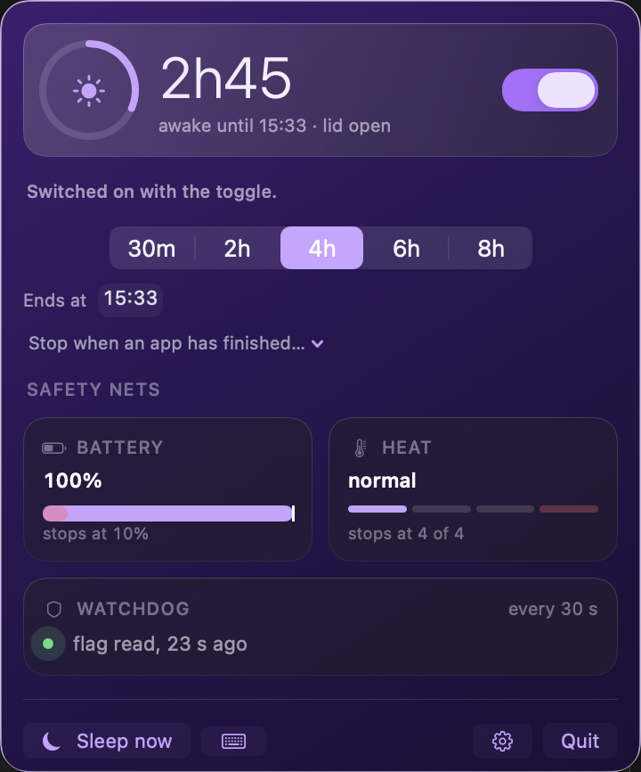

<a id="dopamine-code"></a>

<h1 align="center">
  <br>
  Dopamine Code
</h1>

<p align="center">
  <b>Keeps your Mac awake with the lid closed. No external display needed.</b><br>
  Doing that switches off macOS's emergency sleep. This one puts it back.
</p>

<p align="center">
  <a href="https://github.com/peter46jan/dopamine-code/releases"></a>
  
  
  <a href="LICENSE"></a>
</p>

<p align="center"><b>English</b> · <a href="#nederlands">Nederlands</a></p>

```bash
brew tap peter46jan/dopamine
brew install dopamine-code
ln -sfn "$(brew --prefix)/opt/dopamine-code/Dopamine Code.app" /Applications/
```

A macOS menu bar app. Two things: keeping the Mac awake with the lid closed and no external
display, and switching the keyboard backlight. Built as personal tooling for one Mac, and
written on that assumption — there is no installer, no automatic update, and it has been
tested on one machine.



Available in **Dutch, English, German and French**. The app follows the macOS language order
and falls back to Dutch when none of the four is present. Translations live in
[Resources/](Resources/), one `.lproj` per language; `./verify.sh --talen` checks that all
four carry the same keys and the same format placeholders. The log stays Dutch: it is
diagnostic tooling, and `verify.sh` and the audit read those lines back.

```
./build.sh --install     build, sign, put in /Applications and launch
./verify.sh --report     read status, no password and no side effects
./verify.sh              every check, including the two that need your password
./verify.sh --after      after a real session: did the Mac sleep anyway?
./release.sh 1.1.0       cut a release (tag + draft release on GitHub)
./verify.sh --talen      check that the four languages stay in step
```

Or install it with `brew tap peter46jan/dopamine && brew install dopamine-code`.

---

## Why this needs root, and what it does not get

Keeping a Mac awake with the lid closed comes down to one kernel flag, `SleepDisabled`, and
`pmset` is the only thing that can write it — as root. So the app installs one sudoers rule
that makes exactly two commands passwordless, **arguments included**:

```
<your-username> ALL=(root) NOPASSWD: /usr/bin/pmset -a disablesleep 1, /usr/bin/pmset -a disablesleep 0
```

Those arguments are the whole point: `man sudoers` grants *any* arguments when you leave them
out, so the same rule without them would hand over all of power management as root —
`pmset restoredefaults`, `pmset schedule wake`, the lot. Nothing else runs as root: the
watchdog is a LaunchAgent in your own user session that may only read, the command line links
no IOKit and knows no `pmset`, and the update check never downloads or executes anything.

`verify.sh` tries four other `pmset` commands and fails if even one gets through. The full
reasoning, including two findings a security audit turned up and how they were fixed, is in
[The sudoers rule](#the-sudoers-rule) and [SECURITY-AUDIT.md](SECURITY-AUDIT.md) (Dutch).

---

## What it switches off, and what takes over

The flag does more than stop clamshell sleep. `SleepDisabled` becomes `userDisabledAllSleep`
in `IOPMrootDomain`, which `checkSystemSleepAllowed()` rejects — and that is the same gate the
kernel's **low-battery** and **overheating** emergency sleeps pass through. Anything that sets
this flag switches off both of them.

So the app does not leave that gap open. It replaces them, and these three cannot be switched
off:

| Replaces | What the app does | Default |
|---|---|---|
| forgetting about it | releases the flag after a set time | 7 hours |
| low-battery emergency sleep | releases the flag below a battery percentage, on battery power | 15% |
| overheat emergency sleep | releases the flag immediately at `thermalState == .critical` | always on |

Plus a watchdog: `SIGKILL` cannot be caught, so a LaunchAgent in your own user session checks
every 30 seconds whether the flag is set with no app running, and relaunches the app to clean
up. Without that, a crash would leave a Mac that never sleeps again until someone runs
`sudo pmset -a disablesleep 0` by hand.

**Where this is genuinely weaker than the kernel:** the kernel's brakes work whether or not a
process is alive; these need the app running. The watchdog narrows that to about 30 seconds,
but it is a gap and not an equivalent. And whether `thermalState == .critical` fires at the
same point the kernel's emergency sleep would have is an assumption, not a measurement. Both
are in [What has not been proven yet](#what-has-not-been-proven-yet).

---

## Building it yourself

With Homebrew:

```bash
brew tap peter46jan/dopamine
brew install dopamine-code
ln -sfn "$(brew --prefix)/opt/dopamine-code/Dopamine Code.app" /Applications/
```

That builds from source rather than downloading a binary, and deliberately so: Homebrew puts
the quarantine attribute on anything it downloads, so an app that is not notarised by Apple
gets blocked by Gatekeeper. A locally compiled one never is. The third line is needed because
a formula may not write outside its own prefix.

Or straight from the source:

```bash
git clone https://github.com/peter46jan/dopamine-code.git
cd dopamine-code
./build.sh --install
```

*Was called "Wakker" until 11 August 2026. The sudoers rule and the log moved along with it.
Coming from an older install with a different bundle ID? The app starts with empty settings;
move them across with `defaults export <old-id> - | defaults import <new-id> -`.*

Either way you need **macOS 14 or newer** and the Xcode command line tools (`xcode-select --install`).
No Xcode project, no Apple Developer account. There is no Gatekeeper warning either: a
locally built app never gets a `com.apple.quarantine` attribute, so the right-click-Open
detour is not needed.

On first use the app asks once for your admin password, for a sudoers rule that makes exactly
two `pmset` commands passwordless. What that rule does and does not allow is written out in
[The sudoers rule](#the-sudoers-rule); why it is that narrow, in
[SECURITY-AUDIT.md](SECURITY-AUDIT.md) (Dutch).

**About signing.** Without an identity `build.sh` signs ad-hoc, and that is the default. It
works, but an ad-hoc signature is pinned to the cdhash: if you ever grant the app
Accessibility permission, that grant lapses on every rebuild. If you have an
`Apple Development` certificate in your keychain, pass its name and the grant survives a
rebuild:

```bash
# once, stays out of git
echo "Apple Development: Your Name (XXXXXXXXXX)" > .signing-identity

# or per build
DOPAMINE_SIGN_IDENTITY="Apple Development: Your Name (XXXXXXXXXX)" ./build.sh --install
```

`security find-identity -v -p codesigning` shows which ones you have.

**Building without git.** `build.sh` takes the version from `git describe`. Building from a
source tarball there is no `.git`, and the app would call itself `0.0.0`. Pass the version in
instead: `DOPAMINE_VERSION=1.0.1 ./build.sh`. That is what the Homebrew formula does.

---

## Updating

```bash
git pull && ./build.sh --install
```

The app checks once a day whether a newer version exists and puts that in the menu as a quiet
line. That is all it does: nothing is downloaded and nothing is installed. Updating stays
that one command you run yourself, in the folder holding the source.

> **Only works after the first release.** `releases/latest` returns a 404 as long as there is
> no published release — a draft does not count. The app handles that gracefully (it logs it
> and shows nothing), but until then the check yields nothing. See
> [Cutting a release](#cutting-a-release).

That is a choice, not a shortcoming. An app that replaces itself needs a channel along which
code arrives from outside — and this app has a passwordless route to root. Whoever can forge
that channel gets that route thrown in. As long as GitHub's answer only produces a version
number and a link that are merely *displayed*, that problem does not exist. `verify.sh`
enforces it too: [UpdateCheck.swift](Sources/DopamineCode/UpdateCheck.swift) may not contain
`Process`, `pmset` or any writing file call.

You can switch it off under **Settings → Updates**. That is also where you see which version
you are running, and the button to check right now.

**Without a certificate, updating costs you one extra step.** An ad-hoc signature is pinned
to the binary's cdhash, so every rebuild produces a new one — and macOS ties the Accessibility
grant to it. After updating you have to grant that again. With an `Apple Development`
certificate this does not apply: the designated requirement stays the same and the grant
survives a rebuild.

### Cutting a release

For whoever maintains the repository:

```bash
./release.sh 1.1.0
```

That tags the current commit, pushes the tag, and turns it into a **draft** release with the
commit subjects since the previous tag as a starting point for the notes. You read that text
over and publish it yourself. While it is a draft the update check does not see it —
`releases/latest` skips drafts and pre-releases. That way you can still retract a wrong tag
before anyone gets a notification about it.

The version number in the app comes from that tag. `build.sh` stamps `git describe` into the
bundle's Info.plist on every build; the file in `Resources/` is left alone. Without git or
without tags it becomes `0.0.0`, and then the app honestly says it does not know which version
it is instead of claiming you are up to date.

---

## Step 0: the feasibility check, and what it produced

The sudoers route is safe on this Mac. Measured, not assumed:

| Check | Outcome |
|---|---|
| `profiles status -type enrollment` | `Enrolled via DEP: No` · `MDM enrollment: No` |
| `/Library/Managed Preferences/` | does not exist |
| `/var/db/ConfigurationProfiles/Settings` | only `com.apple.mdm.depnag.plist` (no profile) |
| Jamf / Intune agent | absent — there is a standalone MDM helper, but no enrolment |
| `/etc/sudoers.d/` | exists, empty, `root:wheel 0755`, unmanaged |
| Account | member of `admin` |

Nothing reverts a sudoers rule. The AppleScript fallback from the spec therefore stayed a
fallback rather than becoming the main route — but it is in there and it genuinely gets used
the moment `sudo -n` refuses.

---

## What differs from the spec, and why

Five points. All five because measuring produced something other than what the spec assumed.

### 1. Verification goes through IOKit, not `pmset -g`

The spec says: verify after every switch with `pmset -g`. On this Mac `pmset -g` does **not
print the `SleepDisabled` line at all**:

```
pmset -g | grep -ci sleepdisabled   →  0
```

That is not a macOS 26 regression. In Apple's `pmset.m` the print line sits behind an
`if (key exists in dict)`, and the key only comes into being once `disablesleep` has been set
at least once. On a fresh machine the output is therefore silent — indistinguishable from
"0". An app relying on that reports "off" forever. That exact bug is in the Sleepless project
the spec refers to.

The kernel value itself is always there:

```swift
IORegistryEntryCreateCFProperty(IOPMrootDomain, "SleepDisabled", …)   // CFBoolean
```

No root, no entitlement, no signature needed. That is the source of truth now.

### 2. `pmset` returns exit code 0 while the write failed

This is the most dangerous of the five, because it fails silently. On a failed write `pmset`
writes `'pmset' must be run as root...` or `failed to set the value` to **stdout** and then
still returns exit code 0. Going by exit code alone therefore produces a green icon on a Mac
that simply falls asleep.

The app checks three things: exit code, the text output, *and* the kernel flag.

### 3. The kernel takes the value asynchronously

`pmset` does not write the flag itself. It stores a preference and posts a notification;
`powerd` picks that up and only then sets the IORegistry property. A `read()` straight after
the command returns the **old** value. Verification is therefore a retry ladder of just over
five seconds, not a single check.

### 4. The toggle keycode for the keyboard backlight is dead

The spec suggests `CGEvent` with the illumination keycodes. Measured on this M5:

| | |
|---|---|
| Physical illumination keys on the function row | **gone** (F1–F12 are brightness, Mission Control, Spotlight, dictation, DND, media) |
| `NX_KEYTYPE_ILLUMINATION_UP` (21) / `DOWN` (22) | **work**, in steps of exactly 1/16 |
| `NX_KEYTYPE_ILLUMINATION_TOGGLE` (23) | **does nothing** — posted twice, zero change |

So the OS handler is still alive and independent of the hardware, but precisely the keycode a
"toggle" would rest on is a no-op.

That is why the main route is `CoreBrightness.KeyboardBrightnessClient`, loaded dynamically.
It is still not an SMC write — it is Apple's own brightness client. Advantages measuring
turned up: absolute values instead of steps, a genuine read-back so that on/off can be a real
toggle, and **zero TCC permission**. The CGEvent route is in there as a fallback, and that one
does ask for Accessibility.

Two things that can go wrong there, both caught by the app:

- The ambient light sensor pulls a manually set value back within a minute. Every write
  therefore sets `enableAutoBrightness:false` first.
- Once the display sleeps, the system suppresses the backlight. Writing succeeds, reading is
  correct, and nothing lights up. The app reads `isBacklightSuppressedOnKeyboard:` and says so.

### 5. `disablesleep` also switches off the thermal emergency sleep

This was not in the spec and is the most important addition. In `IOPMrootDomain`,
`SleepDisabled` becomes `userDisabledAllSleep`, which `checkSystemSleepAllowed()` rejects —
the same check the kernel's **empty-battery** and **overheating** emergency sleeps pass
through.

So the flag does not just stop the lid. It switches off the kernel's last line of defence
against overheating. The original rule ("not a closed lid in a bag with a heavy run
underneath") describes exactly the scenario where that counts.

The spec already covered the battery side with the floor. The thermal side is now the software
replacement for what the flag took away: `ProcessInfo.thermalState` is watched, `serious`
produces a warning with sound, and at `critical` the flag comes off immediately — without a
password prompt, because with the lid closed that would hang behind the login screen.

---

## How it fits together

| File | Responsibility |
|---|---|
| `DopamineCodeApp.swift` | `MenuBarExtra` in `.window` style, app delegate, launch and shutdown |
| `AppModel.swift` | the single source of truth; everything is event-driven, nothing is polled |
| `SleepFlag.swift` | reading the kernel flag (IOKit) and writing it (pmset), with verification |
| `SudoersGrant.swift` | installing, checking and removing the rule |
| `DisplayControl.swift` | `pmset displaysleepnow` |
| `ScreenLock.swift` | `SACLockScreenImmediate` via `dlopen` |
| `KeyboardBacklight.swift` | CoreBrightness as the main route, CGEvent as fallback |
| `ThermalWatch.swift` | replaces the emergency sleep the flag switches off |
| `PowerSource.swift` | battery and mains power via IOKit notifications |
| `ClamshellMonitor.swift` | lid state via `kIOPMMessageClamshellStateChange` |
| `NetworkMonitor.swift` | `NWPathMonitor` plus a captive-portal check |
| `LaunchAtLogin.swift` | `SMAppService`, with a LaunchAgent as fallback |
| `RestartGuard.swift` | the watchdog that brings the app back if it disappears with the block on |
| `EventLog.swift` | the log that lets you judge last night's session tomorrow |
| `ConflictWatch.swift` | notices that Amphetamine is running too |
| `ScreenState.swift` | whether the login window is up, so no dialog is ever left stranded behind it |
| `ProcessWatch.swift` | facts about a process: does it still exist, and is it still the same one |
| `RunningApps.swift` | the list of running apps for the process picker in the menu |
| `SessionTrigger.swift` | who started the running session |
| `LidArm.swift` | the one-shot "turn on when I close the lid", valid for five minutes |
| `ScheduleWindow.swift` | pure date arithmetic: does this moment fall in the schedule window, and when did it start |
| `AppTriggerWatch.swift` | notices a chosen app starting or stopping; only nudges the guardian |
| `GlobalShortcut.swift` | the global shortcut via Carbon; keeps no state and calls one closure |
| `SessionHistory.swift` | reads the log back into a list of sessions; starts and stops nothing |
| `ControlServer.swift` | listens on the socket the `dopamine` command line talks to |
| `Sources/Shared/ControlProtocol.swift` | the message format, compiled into both the app and the CLI |
| `Sources/dopamine/main.swift` | the command line; switches nothing itself, asks the app to act |

### The central rule: safety nets watch the kernel, not the app

This is the most important design decision, and it came out of a review that found three
blockers around it.

The first design had the timer, the battery floor and the thermal protection fire on the app's
own status. That is exactly backwards. If the app thinks it is off but `SleepDisabled` is
still 1, the Mac still does not sleep — and *that* is the moment those safety nets have to
work. Every check on `status == .on` stops looking at the moment it matters.

Now there is one guardian that reads the kernel flag every twenty seconds and decides on that:

- Flag is 0 → all quiet, bring status in line.
- Flag is 1 with no active session → put it back, keep trying.
- Flag is 1 with a session → check deadline, battery and heat; intervene if one of the three
  asks for it.

Around that hang event sources (battery notification, thermal notification, lid notification)
that nudge the guardian immediately instead of waiting for the next tick.

Two consequences of that are visible in the app:

- **Anything needing privileges runs off the main thread.** The admin prompt waits for a human
  and can take minutes; on the main thread that would freeze every timer in the app, including
  the guardian itself.
- **Never a dialog behind the login screen.** Prompts wait until the screen is genuinely
  unlocked. A modal window nobody can dismiss blocks the main thread, and with it exactly the
  code that has to put the flag back.

And when the safety nets *cannot* do anything: without the sudoers rule the flag can only be
put back with a password, and with the lid closed nobody can type one. The app then says so in
as many words ("Stopping by itself will not work") instead of pretending everything is fine.

### Triggers are statements, not actors

Phase 3 added three ways to start a session without touching the switch: closing the lid, an
app starting to run, and a schedule. The temptation is to give each of them its own little
timer that switches on at the right moment. That is exactly the second source of truth the
guardian exists to prevent — and it does not work anyway: a schedule that switches on by
itself at 09:00 does not fire if the Mac was asleep at 09:00.

So `ScheduleWindow`, `AppTriggerWatch` and `LidArm` are all three *facts* without a clock of
their own. There is exactly one place that switches on by itself, and that is
`AppModel.evaluateTriggers()`, called from the guardian tick in the branch where the kernel
flag is demonstrably 0. From there, starting goes through the same `startSession` as the
switch, and therefore through the same battery floor, heat limit, time limit and password
exemption.

**The stopping side deliberately sits elsewhere**: in `releaseReason()`, which only runs when
the flag is 1. Phase 3 added no clause to it whatsoever. A schedule window ends via the end
time (the window end is the ceiling, the time limit always overrides it), and an app trigger
ends via the process binding from phase 1 — the same clause as `dopamine on --until-exit`.
Starting is a decision about a quiet machine, stopping is a decision about a running session,
and one function doing both is a function that can bypass the safety nets.

**Every trigger is an edge, never a level.** That is the most important rule of this phase. A
schedule saying "it is a weekday, it is 15:29, nothing is running" would put the Mac back
awake twenty seconds after a battery floor intervened at 15:29 — and then the time limit, the
battery floor and the heat limit are all three worthless within one tick. So:

- The schedule remembers in `Prefs.scheduleLastArmedWindowStart` which window it has already
  had. Persistent, because restarting the app inside the same window must not re-arm it
  either. Every session start inside that window — including a manual one — ticks it off.
- The app trigger only fires on the not-running → running transition, and whatever was already
  running when Dopamine Code started counts as seen.
- The arming is one-shot and is consumed when it fires; otherwise it expires after five
  minutes.

And because a trigger fires while you are not there, hard rule 3 weighs heavier here: every
refused automatic start gets a log line *with the name of the trigger* and a notification. A
successful start gets the log and the panel, but no notification — that one would arrive every
weekday at 09:00 and dilute the six that do matter.

A few choices that are not self-evident:

- **`.window` and not `.menu`.** Menu style drops non-text views and does not redraw its body
  on opening (FB13683957), which makes a live countdown impossible.
- **Lid detection through IOKit.** `NSWorkspace.willSleepNotification` *cannot* fire: the
  whole point is that the system does not sleep. `screensDidSleepNotification` cannot tell a
  closed lid from a display switched off by inactivity. `kIOPMMessageClamshellStateChange`
  fires on the sensor itself. A slow poll runs alongside it, because a missed notification
  during an overnight run defeats the entire purpose.
- **Lock before display-off.** The other way round, the panel lights up again while the login
  window is being built.
- **Display-off is repeated.** `displaysleepnow` is a request, not a latch. With system sleep
  off the Mac runs at full power and all sorts of things can switch the panel back on —
  invisibly, for hours. While the lid is closed the request is repeated every 30 seconds.
- **Sound, not blinking, as confirmation.** The spec offered both. With the lid closed a
  blinking keyboard backlight is invisible by definition; sound is not.

### The shortcut, the countdown and the history

Phase 4 added three things to the controls and one to looking back. What they have in common:
none of the four keeps any state.

**The shortcut** you set yourself under Settings → General; none is shipped. A default
combination can clash on first launch with something you already use, and you only notice such
a clash when *that other thing* stops working. It runs through Carbon's `RegisterEventHotKey`
rather than `NSEvent.addGlobalMonitorForEvents`: the latter reads every keystroke on the whole
system and therefore asks for Accessibility, and that grant is off on this Mac. Carbon asks for
nothing and links in automatically — `build.sh` needed no change for it. On the keypress it
reads `intendedOn` and then goes through exactly the same route as the switch: the same time
limit, battery floor, temperature watch and password-exemption check. If it does not go
through you hear the error sound and it is in the log; no notification comes, because you are
at the keyboard at that moment.

**The countdown** in the menu bar (`3:15`, on by default, switchable under Settings → General)
works from the same end time the limit itself works from — no timer of its own, no starting
point of its own. Change the duration mid-session and it moves along. It only appears while a
session is running: with the block on and no session, nothing is running down, and a number
there would make a promise nobody keeps. You then only see the lightning icon, which says
exactly that.

**"Until 18:00"** in the panel is the same setting as the duration, phrased differently. The
clock time is converted to minutes and goes through the same path as the duration buttons, so
no second end time is stored anywhere. During a running session the arithmetic starts from the
moment you switched on and not from now — otherwise a session started at 14:00, for which you
pick "until 18:00" at 15:00, would stop at 17:00. Ask for more than 24 hours and it is clamped,
and the panel says which end time you get instead. And because it writes the ordinary duration
setting, that odd duration stays put for the next session too.

**The history** (Settings → History) is the log, made readable. Nothing is kept separately and
there is not a single button that switches anything on or off. Sessions whose end is not in
the log do not disappear but get a line of their own: that is the case where the app fell away
— exactly what the phase 2 safety net exists for. Whether something is running right now does
*not* come from that text but from the app itself; the log only knows something about an end
once the end exists.

---

## The command line (`dopamine`)

A build or an agent knows precisely when it starts and when it is done. Guessing up front how
long you will be busy is therefore the crudest safety net there is, and the command line
replaces that guesswork with the real answer:

```
dopamine on --until-exit $$      # stay awake as long as this script runs
dopamine on --for 2h             # or just a duration
dopamine on --until 18:00        # or an end time
dopamine off
dopamine status --json
```

The binary lives in the bundle (`Contents/MacOS/dopamine`) and never ends up on your PATH by
itself. `build.sh` and Settings → Diagnostics show an `ln -sfn` line to paste — an app that
puts something in a system directory on its own is doing something nobody asked for.

**It switches nothing itself.** It does not link IOKit, does not know `pmset` and does not
launch the app: it opens a socket, asks a question and prints the answer. Two processes both
managing the kernel flag is exactly the conflict this project holds against Amphetamine, and
that must not sneak in here through a back door. `verify.sh` checks that with `otool -L` and
with a grep over the sources; the moment anything creeps in there, the test fails.

Every request goes through the same `startSession`/`stopSession` as the switch in the menu
bar, and therefore through the same refusals: an empty battery, a Mac that is too warm, and a
missing password exemption. A duration is clamped to between 5 minutes and 24 hours, and the
answer reports what you actually got. A running session is never extended — a build script
calling `dopamine on` in a loop would otherwise push the time limit forward indefinitely and
silently disable the safety net. Shorter is allowed, and so is setting a binding.

Exit codes: `0` succeeded, `1` refused by a safety net, `2` wrong usage, `4` the app is not
running. With `--json` the output is always valid JSON, including on an error.

### Why a unix socket, and not XPC or a file

- **XPC** requires a Mach service name, and you can only register one through a launchd job.
  This app does not have one guaranteed — `LaunchAtLogin` writes one at most as a fallback —
  so XPC would make a LaunchAgent mandatory and thereby settle a choice that has to stay open.
- **A file as a mailbox** has no reply channel. Then `dopamine on` cannot report *that* the
  kernel write failed, and a command is left lying around to be executed later in a situation
  nobody asked for.
- **A socket** only exists while the app is running. "The app is not running" becomes an
  ordinary `connect()` error that can be reported honestly (exit code 4) instead of guessed.

The socket lives at `~/Library/Application Support/Dopamine Code/beheer.sock` — measured at 74
bytes against a limit of 103 in `sun_path`, and the app refuses cleanly with a log line if that
path ever grows longer. The directory is `0700`, the socket `0600`, and every connection is
checked against your own uid through `LOCAL_PEERCRED`.

One surprise the test rig produced that is worth mentioning: on BSD — and therefore on macOS —
**an accepted socket inherits the listener's `O_NONBLOCK`**. Without clearing that flag the
first `read()` returns EAGAIN straight away, the app reports "connection with no readable
request" and the CLI sees an EPIPE: everything looks broken while nothing is wrong.

### Stopping when a process finishes

`--until-exit 4711` binds the session to a process id, and in the menu bar panel you can do
the same for a running app. Alongside the pid, the process's **start time** is stored: a pid
gets reused, and without that start time a session would stay bound to a pid that now belongs
to an entirely different program.

The binding is an extra reason to stop, never a reason to keep going. The time limit, the
battery floor and the temperature watch sit *above* it in `releaseReason()`: a process that
hangs must not postpone the timer. A process-bound session therefore ends at the process or at
the timer, whichever comes first.

Two routes notice the process is gone, and that is deliberate: a `DispatchSource` on the exit
reports it immediately, and the 20-second guardian tick looks in the kernel table itself. The
poll is the guarantee, the notification only the speed — exactly the construction
`ClamshellMonitor` already uses. Measured: that notification also fires immediately for a pid
that does not exist (which is why a non-existent pid is refused at start), and never for a
process belonging to another user (which is why a log line then records that only the poll is
watching). If the poll notices an exit the notification did not report, a WARN line is added:
silent degradation is still degradation.

The binding does not survive a restart of the app and is *not* in the settings. A session
reviving without the battery, heat and permission checks that started it is precisely what
this app must not do.

---

## The sudoers rule

Path `/etc/sudoers.d/dopamine-code-disablesleep`, `root:wheel`, `0440`. Contents:

```
<your-username> ALL=(root) NOPASSWD: /usr/bin/pmset -a disablesleep 1, /usr/bin/pmset -a disablesleep 0
```

That the arguments are spelled out is the whole point. `man sudoers` on this Mac:

> *If no command line arguments are specified, the user may run the command with any
> arguments they choose. … If a Cmnd has associated command line arguments, the arguments
> in the Cmnd must match those given by the user on the command line.*

Without those arguments the rule would passwordlessly allow `pmset restoredefaults`,
`pmset -a hibernatemode 0` and `pmset schedule wake` — effectively all of power management as
root. `verify.sh` tests that explicitly: it tries four other pmset commands and fails if even
one gets through.

Deliberately left out:

- **No `sha256:` digest.** `/usr/bin/pmset` sits on the sealed system volume and cannot be
  replaced; a digest would only break on every macOS update.
- **No wildcard** (`disablesleep [01]`). Two literal commands are strictly narrower.
- **No helper script as the sudo target.** Running a user-writable script as root is the
  classic sudoers trap. The rule points straight at `pmset`.
- **`displaysleepnow` is not in it.** That needs no root; adding it would enlarge the
  privilege surface without solving anything.

### Two things the review found here

**The check on the rule was too credulous.** The app asked `sudo -n -l <command>` and read
exit code 0 as "rule active". That is wrong: `man sudo` says exit code 0 means *the command is
permitted*, not that it may run without a password. And `man sudoers` says that a single
NOPASSWD rule already makes the `sudo -l` command itself passwordless. Together with macOS's
default `%admin ALL=(ALL) ALL` that means: as soon as any NOPASSWD rule exists anywhere, the
check succeeds for *every* pmset command — even when the Dopamine Code rule is absent.

The consequence would be: green icon, "rule active", and then no safety net intervenes at all
when the battery runs down. The app now uses `sudo -n -l -l`, which per `man sudo` shows "the
matching rule in expanded form", and explicitly demands `!authenticate` or `NOPASSWD` in the
output. If it does not recognise the format it reports "not working" — erring towards a
needless warning is infinitely better than erring towards a Mac that never sleeps again.

**The script ran as root from a path you can overwrite.** `grant.sh` lived in
`Contents/Resources`, and that bundle sits in `/Applications` owned by you. Any process
running as you could modify that file; you then type your admin password for a dialog saying
"a sudoers rule for exactly two pmset commands", and something else entirely runs as root.
Checking the signature beforehand does not fix it — root reopens the path afterwards, so the
file can be swapped in between.

Now `build.sh` bakes the script text into the binary and the app pipes it to the root shell —
both the button in Settings and the fallback line for Terminal. There is no path left to
replace. The readable copy stays in the bundle, because you can inspect it, but it is no
longer executed as root anywhere: no route runs a file from disk.

That last part was not right first time. A security audit caught that the Terminal fallback
and the removal line below both still showed `sudo <bundle>/grant.sh` — a user-writable file,
as root. Both were converted: the fallback pipes the baked-in payload, and removal is now one
transparent line you can read yourself.

The filename has no dot and does not end in `~`. That is not a matter of taste: sudo skips
such files **silently** — no error, no log line, just a rule that never works. `grant.sh`
therefore refuses to install if the name would violate that pattern, checks that
`/etc/sudoers` reads the directory at all, validates with `visudo -cf` before installing, and
rolls the rule back if `visudo -c` no longer parses cleanly afterwards.

You remove it with the button under Settings → Diagnostics (which pipes the baked-in payload
with `--remove`), or by hand — the rule is nothing more than deleting the file, so you can
read it before you run it:

```
sudo rm -f /etc/sudoers.d/dopamine-code-disablesleep
```

---

## Signing

By default the app is signed **ad-hoc**: no certificate, and the identity is the cdhash.

```
designated => cdhash H"…"
```

That works and needs nothing from you. The price is that the identity changes on every
rebuild, which matters in one place: TCC ties the Accessibility grant to the designated
requirement, so if you ever grant it, that grant lapses on the next build. On this Mac
Accessibility is off — the brightness route runs through CoreBrightness, which asks for no TCC
— so in practice the price is zero.

With an `Apple Development` identity from your own keychain you get a requirement that does
survive a rebuild:

```
designated => identifier "com.peter46jan.dopaminecode" and anchor apple generic
              and certificate leaf[subject.CN] = "Apple Development: <name> (<team-id>)"
```

No `cdhash` there. If the certificate expires the signature stays valid thanks to
`--timestamp`, and a renewal yields the same CN, so the requirement does not change and the
grant stays put. Which identity `build.sh` picks is described under
[Building it yourself](#building-it-yourself).

There is one more place the difference shows: the watchdog checks the bundle on disk against
the designated requirement of the *running* binary. Under a certificate that is an identity
requirement; under ad-hoc it is a cdhash requirement, which also refuses a *newer* build of
the app itself until that build is the one running. `build.sh --install` builds and relaunches
in one action, so those two stay in step.

Gatekeeper plays no part: a locally built app never gets a `com.apple.quarantine` attribute.
The right-click-Open ritual from the spec is not needed.

---

## Testing

`./verify.sh` does everything that can be done automatically. Two steps ask something of you:
your password for the `disablesleep` round trip, and consent for the display-off test (which
locks your screen, because your system is set to `immediate`).

What the script checks:

1. Does `/etc/sudoers` read the `sudoers.d` directory at all?
2. Does `sudo pmset -a disablesleep 1` genuinely set the kernel flag to 1 on this M5, and does
   `AppleClamshellCausesSleep` go to `false` with it? Then neatly back to 0.
3. Is the rule `root:wheel 0440`, does `visudo -c` parse cleanly, are exactly the two allowed
   commands passwordless and no other pmset command at all?
4. Does `pmset displaysleepnow` work without root?
5. Is `CoreBrightness.KeyboardBrightnessClient` reachable?
6. Does `SACLockScreenImmediate` exist, and is locking set to `immediate`?
7. Does the command line stay away from the kernel flag — does no file of `dopamine` touch
   `pmset`, IOKit or the flag, and is there still exactly one place in the whole source tree
   that switches the block on?
8. Does the watchdog stay away from the kernel flag? It runs as the same binary and therefore
   has the same password exemption within reach; it may only read.
9. Do the four translations carry the same keys and the same format placeholders, and does
   every key the code uses exist?
10. Do the stored "start at login" preference and what the system actually does agree?

Separately, and deliberately not in the standard round because it ends your running session:

```
./verify.sh --killtest
```

That kills the app outright during a session and checks whether the watchdog clears the sleep
block within two minutes. It is the only gap `SIGTERM` does not cover, so it is also the only
one you cannot demonstrate without actually doing it.

### The scenarios from the spec that can only be done by hand

| Scenario | How you check it |
|---|---|
| Lid closed, no external display, awake for hours | Switch "Keep this Mac awake" on, close the lid, let a run go. Then `./verify.sh --after`: every `Clamshell Sleep` in the pmset log is a failure |
| Display really was off, battery not abnormally drained | Note the battery level before and after; the log contains the timestamp of every `displaysleepnow` |
| Password on opening the lid | Open the lid; it must ask for a password or Touch ID |
| Wi-Fi off during a session | Switch Wi-Fi off, wait a bit, switch it on. On opening the lid, "connection was gone for X minutes at HH:MM" appears |
| Forgot to switch it off | Set the timer in the settings to 5 or 30 minutes, wait it out, check with `./verify.sh --report` that `SleepDisabled false` |
| Battery below the floor | Temporarily set the floor to, say, 60%, unplug, wait |
| Sudoers missing or blocked | `sudo rm /etc/sudoers.d/dopamine-code-disablesleep`, then switch: an admin prompt should appear, not silence |
| Force-quitting the app with the flag on | `./verify.sh --killtest` while "Keep this Mac awake" is on. The app is killed with `kill -9`; the safety net should bring it back within two minutes, after which the block is cleaned up by itself. Without the safety net the flag stays set until you start the app yourself |
| A clean quit does not provoke a restart | Switch "Keep this Mac awake" off, then quit the app via Quit. Wait two minutes: nothing should come back, and the log names no safety-net line at all |
| macOS update | Run `./verify.sh` again. The sudoers rule and the permission usually survive an update, but the private symbols from `CoreBrightness` and `login.framework` are exactly what Apple can change unnoticed |

---

## What has not been proven yet

Honestly, because this is exactly the category the spec calls out.

**Setting the flag has by now been proven on this hardware.** Measured there and back with the
installed sudoers rule:

```
before:  SleepDisabled=false
→ sudo -n /usr/bin/pmset -a disablesleep 1   exit code 0
   kernel followed after 0.25 s
after:   SleepDisabled=true
pmset -g now shows:  SleepDisabled  1      ← exactly as the source analysis predicted
→ sudo -n /usr/bin/pmset -a disablesleep 0
restored: SleepDisabled=false
```

And that same test produced unplanned evidence that two safety nets work. From the log:

```
07:36:00 [WARN] Signaal 15 ontvangen met vlag aan — terugzetten naar 0.
07:37:43 [INFO] Blijf actief UIT (vlag stond aan zonder actieve sessie).
```

The first line is the SIGTERM handling that cleared the flag when `build.sh --install` shut
the app down. The second is the guardian catching the flag I had set outside the app and
putting it back. Neither was part of the test.

**The lid-closed run has by now been done.** 2026-08-11, 17:58:26 → 19:43:44: one hour and 45
minutes with the lid closed and no external display. The Mac did not sleep. Three independent
checks, because the filter in `verify.sh --after` was written that same day and must not judge
itself:

```
sysctl kern.waketime  →  17:53:33   last kernel wake, before the session began
pmset -g log          →  the day's last Sleep/Wake is 17:53:34, nothing after
                         (831 Assertions lines in the window, zero sleep events)
negative control      →  the same query does find four Clamshell Sleeps earlier
                         that day: 14:03:47, 14:22:59, 15:21:41, 17:03:55
```

The third line is the important one: the method demonstrably sees exactly the failure mode
being tested for, and does not see it during the session.

So the source chain that predicted this holds: `SleepDisabled` → `userDisabledAllSleep` →
`checkSystemSleepAllowed()` blocks the `privateSleepSystem(kIOPMSleepReasonClamshell)` that
this Mac's pmset log demonstrably uses. Longer than 1 h 45 has not been measured; the veto does
not wear off, but proven is proven up to there.

**`AppleClamshellCausesSleep` is not a gauge.** I first used it as confirmation that the flag
worked. Measured: it was `Yes` before setting, `Yes` after, and `Yes` after putting it back. It
follows the lid/desktop-mode policy, not the sleep veto — that sits further along in
`checkSystemSleepAllowed()`. Both the app and `verify.sh` would have reported a working
mechanism as broken on that assumption.

**`pmset displaysleepnow` as an ordinary user works.** Executed by the app itself, which runs
as the logged-in user without root and without an entitlement — log 17:58:27 and 16:40:01,
both `Displayslaap geforceerd`, which is only logged when both the exit code and the text
output are clean. The privilege does indeed sit as an entitlement on `pmset`'s binary, not on
the caller. The sudoers rule does not need widening for it.

**Whether the lid notification fired still cannot be established.** The app reacted to the lid
closing within the same second at 17:58:26, which fits the notification — but the ten-second
poll may have coincided, and `ClamshellMonitor.handle()` does not log *which* of the two saw
the change. While that is so, any statement about it is a guess. (The code note in
`ClamshellMonitor.swift` says "never seen it fire"; a working document claimed the opposite for
a while. Neither is substantiated.) If you want to know: have `handle()` log the source and
close the lid once. Practically it makes no difference — the poll catches it either way, with
at most ten seconds' delay.

**Whether the lid arming is in time has not been measured — and that is the weak spot of phase
3.1.** The arming fires as soon as the app sees the lid is closed. With the sleep block still
at 0 that is a race: macOS starts going to sleep within seconds of the lid closing, and in that
time the app has to see the lid change, run through `evaluateTriggers()` and have `pmset` set
the flag. The lid notification therefore nudges the guardian immediately rather than waiting
for the next tick (`handleLid`), but whether that is enough depends on the question above —
whether `kIOPMMessageClamshellStateChange` fires on this hardware at all. If it does not, only
the ten-second poll remains, and by then the Mac is long asleep. The outcome in that case is
not dangerous but it is disappointing: nothing happens, and after five minutes the app writes
"the arming has expired" in the log and in the panel. To measure it: arm, close the lid once,
and look in `~/Library/Logs/Dopamine Code/dopamine-code.log` for "Klep dicht … gewapend" and
how many seconds later "Wakker houden AAN" follows. The other two triggers do not have this
problem: they fire while the Mac is plainly awake.

**`SMAppService` on a dev-cert-signed, non-notarised bundle** has not been exercised, because
that writes to the background task database. The error handling now does distinguish between
"already registered" (no error), "refused by the user" (do not route around it) and a genuine
refusal (only then the LaunchAgent). You can check with `sfltool dumpbtm | grep -A12 dopamine`,
without sudo.

**Amphetamine is still running.** While that is the case it cannot be established which of the
two is keeping the Mac awake. The app notices and offers to quit Amphetamine. Do that before
the first real test, otherwise it proves nothing.

**Whether `open` works from a launchd agent with a locked screen and the lid closed has not
been measured.** That is precisely the case the phase 2 safety net was built for, so as long as
that is unmeasured, the safety net is only proven for when you are sitting there. A fallback is
built in: if the app is not back 55 seconds after `open`, the watchdog launches the binary
directly with `posix_spawn` (in its own session, so launchd does not immediately reap it) and
writes a WARN line about it. To demonstrate it, use `./verify.sh --killtest`, once with the
screen unlocked and once with the lid closed and the screen locked. That second run is the only
real evidence.

**The watchdog round itself has been measured.** Called manually during a running session: 0.4
seconds, conclusion "the app is running", not a single write, and its own process correctly
filtered out of `pgrep -x DopamineCode`. That last part is the quietest way this safety net
would never fire: the watchdog *is* the same binary as the app. With a copy that saw itself as
the only DopamineCode process, the whole decision chain ran through as well: one confirmation,
two confirmations, and then the signature check refusing to launch a tampered bundle.

**That launchd genuinely runs a 30-second agent every 30 seconds with the lid closed, the
screen locked and the Mac on battery, has been measured.** With exactly the plist `RestartGuard`
writes, in `~/Library/LaunchAgents`: `run interval = 30 seconds`, and three runs in 75 seconds.
That is the assumption this entire safety net rests on, so it had no business staying
unmeasured.

One trap found along the way, because the first three measurements did nothing: in the old
ASCII plist form (`{ "RunAtLoad" = true; }`) there are no booleans and no numbers. `plutil`
turns those into the strings `"true"` and `"30"`, launchd ignores both keys without saying a
word, and the agent is then present but never runs. You can see it in `launchctl print`:
without the `run interval` line there is no timer. The app writes the plist through
`PropertyListSerialization` from a Swift dictionary, so with real types — checked with
`plutil -p`.

**That `RegisterEventHotKey` works without Accessibility has been measured; that the shortcut
also fires while another app is in front has not.** Rebuilt separately with exactly the
`swiftc` line from `build.sh`: Carbon links in automatically, `InstallEventHandler` returns 0,
`RegisterEventHotKey` returns 0 and yields a valid reference, without any permission dialog.
What that does not yet settle is the case that matters — you are in Xcode, you press the
combination, and Dopamine Code (a menu bar app with no Dock icon) hears it. That can only be
seen after installing, and that was not allowed while building this phase: a real session was
running from `/Applications`, and a second instance quits itself immediately. If it turns out
not to fire, the log says so: `Sneltoets ⌃⌥⌘D staat klaar.` means registration succeeded, and
then registration is not the problem.

**The menu bar countdown and the two new panels have not been checked visually.** For the same
reason. What *has* been verified: the image itself (rendered separately — 46 pt wide at `3:15`,
53 pt at `12:00`, template flag on, countdown legible next to the mark), and the arithmetic
behind "until 18:00" with five cases, including the one that matters: session started at 14:00,
"until 18:00" chosen at 15:00, result 18:00. The history parser has been run against this Mac's
real log: six sessions, of which the 08:59:51 one correctly appears as "no closing line".

---

## If something gets stuck

The flag is system-wide and survives quitting the app and a restart. If it ever hangs:

```
sudo pmset -a disablesleep 0
ioreg -r -d 1 -c IOPMrootDomain | grep SleepDisabled     # must be "No"
```

The app cleans this up itself on every launch, catches `SIGTERM`, `SIGINT` and `SIGHUP`, and
responds to `willPowerOffNotification`. `SIGKILL` cannot be caught — which is why since phase 2
there is a watchdog: a LaunchAgent (`com.peter46jan.dopaminecode.watchdog`) that starts the same
binary with `--vangnet` every 30 seconds. It reads the kernel, checks whether an app is still
running, and relaunches the app if the block is on with no app. The app then cleans up whatever
was left hanging when it starts.

The watchdog never writes the flag itself and keeps no session state; it decides on the kernel
and on process presence. A clean shutdown leaves a marker behind
(`~/Library/Application Support/Dopamine Code/afsluiting.json`) with the state of the block: if
it was properly off, the app does not come back. If it was still on, it comes back after two
minutes anyway — without the app there is no time limit, no battery floor and no temperature
watch, and that weighs more heavily than "stopped is stopped".

Whether the watchdog is still looking shows in `./verify.sh --report` and under Settings →
Diagnostics, with a button to repair it. It cannot be switched off, just like the temperature
watch.

The log lives at `~/Library/Logs/Dopamine Code/dopamine-code.log` and rotates by itself above a
megabyte.

---

## Licence

[MIT](LICENSE). Use, modify and distribute it, with or without changes, commercially too. The
only condition is that the licence text travels with it.

No warranty, and here that is more than a formality: this app flips a system setting that
disables macOS's emergency brake — the automatic sleep on a nearly empty battery and on
overheating. The three safety nets take that job over, but they have been tested on one Mac.
Read [Why you cannot switch these three off](#5-disablesleep-also-switches-off-the-thermal-emergency-sleep)
and [SECURITY-AUDIT.md](SECURITY-AUDIT.md) before putting it on a machine where it matters.

---
---

# Nederlands

<p align="center">
  <b>Houdt je Mac wakker met de klep dicht. Zonder extern scherm.</b><br>
  Dat zet de noodslaap van macOS uit. Deze zet er zijn eigen voor terug.
</p>

<p align="center">
  <a href="https://github.com/peter46jan/dopamine-code/releases"></a>
  
  
  <a href="LICENSE"></a>
</p>

<p align="center"><a href="#dopamine-code">English</a> · <b>Nederlands</b></p>

```bash
brew tap peter46jan/dopamine
brew install dopamine-code
ln -sfn "$(brew --prefix)/opt/dopamine-code/Dopamine Code.app" /Applications/
```

*Heette tot 11 augustus 2026 "Wakker". Sudoers-regel en logboek zijn meeverhuisd. Kom je van
een oudere installatie met een ander bundle-ID, dan begint de app met lege instellingen:
verhuizen kan met `defaults export <oud-id> - | defaults import <nieuw-id> -`.*

Menubalk-app voor macOS. Twee dingen: de Mac actief houden met de klep dicht en zonder
extern scherm, en de toetsenbordverlichting schakelen. Gebouwd als persoonlijk gereedschap
voor één Mac, en met die aanname geschreven — er is geen installer, geen automatische
update, en getest is er op één machine.


Beschikbaar in het **Nederlands, Engels, Duits en Frans**. De app volgt de taalvolgorde van
macOS en valt terug op Nederlands als er geen van de vier bij zit. De vertalingen staan in
[Resources/](Resources/), één `.lproj` per taal; `./verify.sh --talen` controleert of ze
alle vier dezelfde sleutels en dezelfde invulwaarden hebben. Het logboek blijft Nederlands:
dat is diagnostisch gereedschap, en `verify.sh` en de audit lezen die regels terug.

```
./build.sh --install     bouwen, ondertekenen, in /Applications zetten en starten
./verify.sh --report     status lezen, zonder wachtwoord en zonder bijwerkingen
./verify.sh              alle controles, inclusief de twee die je wachtwoord nodig hebben
./verify.sh --after      na een echte sessie: heeft de Mac tóch geslapen?
./release.sh 1.1.0       een versie uitbrengen (tag + concept-release op GitHub)
./verify.sh --talen      controleer of de vier talen gelijk lopen
```

Of installeer hem met `brew tap peter46jan/dopamine && brew install dopamine-code`.

---

## Waarom hier root voor nodig is, en wat het níet krijgt

De Mac wakker houden met de klep dicht komt neer op één kernelvlag, `SleepDisabled`, en
`pmset` is het enige dat die kan schrijven — als root. Daarom installeert de app één
sudoers-regel die precies twee commando's wachtwoordloos maakt, **inclusief de argumenten**:

```
<jouw-gebruikersnaam> ALL=(root) NOPASSWD: /usr/bin/pmset -a disablesleep 1, /usr/bin/pmset -a disablesleep 0
```

Die argumenten zijn het hele punt: `man sudoers` staat *elk* argument toe als je ze weglaat,
dus dezelfde regel zonder die argumenten zou het complete energiebeheer als root weggeven —
`pmset restoredefaults`, `pmset schedule wake`, alles. Verder draait er niets als root: de
wachter is een LaunchAgent in je eigen gebruikerssessie die uitsluitend mag lezen, de
opdrachtregel linkt geen IOKit en kent `pmset` niet, en de updatecontrole downloadt of voert
nooit iets uit.

`verify.sh` probeert vier andere `pmset`-commando's en faalt als er ook maar één doorheen
komt. De volledige redenering, inclusief twee bevindingen die een security-audit opleverde en
hoe die gedicht zijn, staat in [De sudoers-regel](#de-sudoers-regel) en
[SECURITY-AUDIT.md](SECURITY-AUDIT.md).

---

## Wat het uitschakelt, en wat het daarvoor terugzet

De vlag doet meer dan het slapen bij een dichte klep stoppen. `SleepDisabled` wordt
`userDisabledAllSleep` in `IOPMrootDomain`, wat `checkSystemSleepAllowed()` afkeurt — en dat is
dezelfde poort waar de **lege-accu-** en **oververhittingsnoodslaap** van de kernel doorheen
gaan. Alles wat deze vlag zet, schakelt die twee dus ook uit.

Daarom laat de app dat gat niet open. Hij vervangt ze, en deze drie zijn **niet uit te zetten**:

| Vervangt | Wat de app doet | Standaard |
|---|---|---|
| dat je het vergeet | laat de vlag na een ingestelde tijd los | 7 uur |
| noodslaap bij lege accu | laat de vlag los onder een accupercentage, op accustroom | 15% |
| noodslaap bij oververhitting | laat de vlag onmiddellijk los bij `thermalState == .critical` | altijd aan |

Daarbovenop een wachter: `SIGKILL` is niet af te vangen, dus een LaunchAgent in je eigen
gebruikerssessie kijkt elke 30 seconden of de vlag aan staat zonder dat er een app draait, en
start de app opnieuw om op te ruimen. Zonder dat zou een crash een Mac achterlaten die nooit
meer slaapt, tot iemand met de hand `sudo pmset -a disablesleep 0` draait.

**Waar dit werkelijk zwakker is dan de kernel:** de noodgrepen van de kernel werken of er nu
een proces draait of niet; deze hebben de app nodig. De wachter knijpt dat terug tot ongeveer
30 seconden, maar het is een gat en geen gelijkwaardige vervanging. En of
`thermalState == .critical` afgaat op hetzelfde punt waar de noodslaap van de kernel dat deed,
is een aanname en geen meting. Beide staan in
[Wat nog niet bewezen is](#wat-nog-niet-bewezen-is).

---

## Zelf bouwen

Met Homebrew:

```bash
brew tap peter46jan/dopamine
brew install dopamine-code
ln -sfn "$(brew --prefix)/opt/dopamine-code/Dopamine Code.app" /Applications/
```

Dat bouwt uit de bron in plaats van een binary te downloaden, en dat is met opzet: Homebrew
zet het quarantaine-attribuut op alles wat het ophaalt, dus een app die niet door Apple
genotariseerd is wordt door Gatekeeper geblokkeerd. Een lokaal gecompileerde nooit. De derde
regel is nodig omdat een formule niet buiten zijn eigen map mag schrijven.

Of rechtstreeks uit de bron:

```bash
git clone https://github.com/peter46jan/dopamine-code.git
cd dopamine-code
./build.sh --install
```

Hoe dan ook nodig: **macOS 14 of nieuwer** en de Xcode command line tools (`xcode-select --install`).
Geen Xcode-project, geen Apple Developer-account. Er komt geen Gatekeeper-waarschuwing:
een lokaal gebouwde app krijgt geen `com.apple.quarantine`-attribuut, dus er is geen
rechtsklik-Openen-omweg nodig.

Bij het eerste gebruik vraagt de app één keer om je adminwachtwoord, voor een sudoers-regel
die precies twee `pmset`-commando's wachtwoordloos maakt. Wat die regel wel en niet toestaat
staat uitgeschreven in [De sudoers-regel](#de-sudoers-regel); waarom hij zo smal is, in
[SECURITY-AUDIT.md](SECURITY-AUDIT.md).

**Over ondertekenen.** Zonder identiteit tekent `build.sh` ad-hoc. Dat werkt, maar een
ad-hoc handtekening zit vast aan de cdhash: na elke herbouw is je Toegankelijkheid-toestemming
weg en moet je die opnieuw geven. Heb je een `Apple Development`-certificaat in je
sleutelhanger, geef de naam dan mee — dan overleeft de toestemming een herbouw:

```bash
# eenmalig, blijft buiten git
echo "Apple Development: Jouw Naam (XXXXXXXXXX)" > .signing-identity

# of per build
DOPAMINE_SIGN_IDENTITY="Apple Development: Jouw Naam (XXXXXXXXXX)" ./build.sh --install
```

`security find-identity -v -p codesigning` laat zien welke je hebt.

**Bouwen zonder git.** `build.sh` haalt de versie uit `git describe`. Bouw je uit een
bron-tarball, dan is er geen `.git` en zou de app zichzelf `0.0.0` noemen. Geef de versie dan
mee: `DOPAMINE_VERSION=1.0.1 ./build.sh`. Dat is wat de Homebrew-formule doet.

---

## Bijwerken

```bash
git pull && ./build.sh --install
```

De app kijkt eens per dag bij GitHub of er een nieuwere versie is en zet dat als een stille
regel onderin het menu. Meer doet hij niet: er wordt niets gedownload en niets
geïnstalleerd. Bijwerken blijft dat ene commando dat jij zelf draait, in de map waar je de
bron hebt staan.

> **Werkt pas na de eerste release.** `releases/latest` geeft een 404 zolang er nog geen
> gepubliceerde release is — een concept telt niet mee. De app gaat daar netjes mee om (hij
> logt het en toont niets), maar tot dat moment levert de controle niets op. Zie
> [Een versie uitbrengen](#een-versie-uitbrengen).

Dat is een keuze, geen tekortkoming. Een app die zichzelf vervangt heeft een kanaal nodig
waarlangs code van buiten binnenkomt — en deze app heeft een wachtwoordloze route naar
root. Wie dat kanaal kan vervalsen, krijgt die route erbij. Zolang het antwoord van GitHub
alleen een versienummer en een link oplevert die getóónd worden, bestaat dat probleem niet.
`verify.sh` controleert dat ook: [UpdateCheck.swift](Sources/DopamineCode/UpdateCheck.swift)
mag geen `Process`, geen `pmset` en geen schrijvende bestandsaanroep bevatten.

Uitzetten kan in **Instellingen → Bijwerken**. Daar staat ook welke versie je draait, en de
knop om meteen te kijken.

**Zonder certificaat kost bijwerken je één handeling extra.** Een ad-hoc handtekening zit
vast aan de cdhash van de binary, dus elke herbouw levert een nieuwe op — en macOS koppelt
de Toegankelijkheid-toestemming daaraan. Na het bijwerken moet je die dus opnieuw geven.
Met een `Apple Development`-certificaat speelt dat niet: dan blijft de designated
requirement gelijk en overleeft de toestemming een herbouw.

### Een versie uitbrengen

Voor wie de repo beheert:

```bash
./release.sh 1.1.0
```

Dat tagt de huidige commit, duwt de tag, en maakt er een **concept**-release van met de
commits sinds de vorige tag als opzet voor de notities. Je leest die tekst na en publiceert
zelf. Zolang het een concept is, ziet de updatecontrole in de app hem niet — `releases/latest`
slaat concepten en pre-releases over. Zo kun je een verkeerde tag nog terugtrekken voordat
er iemand een melding van krijgt.

Het versienummer in de app komt uit die tag. `build.sh` stempelt bij elke build
`git describe` in de Info.plist van de bundel; het bestand in `Resources/` blijft ongemoeid.
Zonder git of zonder tags wordt dat `0.0.0`, en dan zegt de app eerlijk dat hij niet weet
welke versie hij is in plaats van te beweren dat je bij bent.

---

## Stap 0: de haalbaarheidscontrole, en wat die opleverde

De sudoers-route is veilig op deze Mac. Gemeten, niet aangenomen:

| Controle | Uitkomst |
|---|---|
| `profiles status -type enrollment` | `Enrolled via DEP: No` · `MDM enrollment: No` |
| `/Library/Managed Preferences/` | bestaat niet |
| `/var/db/ConfigurationProfiles/Settings` | alleen `com.apple.mdm.depnag.plist` (geen profiel) |
| Jamf / Intune agent | afwezig — er staat wel een los MDM-hulpprogramma, maar zonder inschrijving |
| `/etc/sudoers.d/` | bestaat, leeg, `root:wheel 0755`, niet beheerd |
| Account | lid van `admin` |

Niets draait een sudoers-regel terug. De AppleScript-terugval uit de spec is daarom
terugval gebleven, geen hoofdroute — maar hij zit er wel in en wordt echt gebruikt zodra
`sudo -n` weigert.

---

## Wat er anders is dan in de spec, en waarom

Vijf punten. Alle vijf omdat meten iets anders opleverde dan de spec aannam.

### 1. Verificatie gaat via IOKit, niet via `pmset -g`

De spec schrijft: verifieer na elke schakeling met `pmset -g`. Op deze Mac drukt
`pmset -g` de regel `SleepDisabled` **helemaal niet af**:

```
pmset -g | grep -ci sleepdisabled   →  0
```

Dat is geen macOS 26-regressie. In Apple's `pmset.m` staat de printregel achter een
`if (key exists in dict)`, en de sleutel ontstaat pas nadat `disablesleep` één keer gezet
is. Op een verse Mac is de uitvoer dus stil — niet te onderscheiden van "0". Een app die
daarop vertrouwt, meldt eeuwig "uit". Precies die fout zit in het Sleepless-project
waar de spec naar verwijst.

De kernelwaarde zelf is er altijd wel:

```swift
IORegistryEntryCreateCFProperty(IOPMrootDomain, "SleepDisabled", …)   // CFBoolean
```

Geen root, geen entitlement, geen handtekening nodig. Dat is nu de bron van waarheid.

### 2. `pmset` geeft exitcode 0 terwijl het schrijven mislukte

Dit is de gevaarlijkste van de vijf, want hij faalt stil. `pmset` schrijft bij een
mislukte schrijfactie `'pmset' must be run as root...` of `failed to set the value` naar
**stdout** en geeft daarna alsnog exitcode 0 terug. Op exitcode alleen afgaan levert dus
een groen icoon bij een Mac die gewoon in slaap valt.

De app controleert daarom drie dingen: exitcode, de tekstuitvoer, én de kernelvlag.

### 3. De kernel neemt de waarde asynchroon over

`pmset` schrijft de vlag niet zelf. Het zet een preference en post een notificatie;
`powerd` pikt dat op en zet pas dán de IORegistry-eigenschap. Een `read()` direct na het
commando geeft de **oude** waarde terug. De verificatie is daarom een retry-ladder van
ruim vijf seconden, geen enkele controle.

### 4. De toggle-keycode voor de toetsenbordverlichting is dood

De spec noemt `CGEvent` met de illuminatie-keycodes. Gemeten op deze M5:

| | |
|---|---|
| Fysieke illuminatietoetsen op de functierij | **weg** (F1–F12 zijn helderheid, Mission Control, Spotlight, dictaat, DND, media) |
| `NX_KEYTYPE_ILLUMINATION_UP` (21) / `DOWN` (22) | **werken**, in stappen van exact 1/16 |
| `NX_KEYTYPE_ILLUMINATION_TOGGLE` (23) | **doet niets** — twee keer gepost, nul verandering |

De OS-handler leeft dus nog en staat los van de hardware, maar precies de keycode waar
een "toggle" op zou rusten is een no-op.

Daarom is de hoofdroute `CoreBrightness.KeyboardBrightnessClient`, dynamisch geladen. Dat
is nog steeds geen SMC-write — het is Apple's eigen helderheidsclient. Voordelen die het
meten opleverde: absolute waarden in plaats van stapjes, een echte uitlezing zodat aan/uit
een werkelijke toggle kan zijn, en **nul TCC-toestemming**. De CGEvent-route zit er als
terugval in en vraagt dan wel Toegankelijkheid.

Twee dingen die daarbij mis kunnen gaan en die de app afvangt:
- De omgevingslichtsensor trekt een handmatig gezette waarde binnen een minuut terug.
  Elke schrijfactie zet daarom eerst `enableAutoBrightness:false`.
- Zodra het scherm slaapt onderdrukt het systeem de verlichting. Schrijven lukt dan, lezen
  klopt, en er brandt niets. De app leest `isBacklightSuppressedOnKeyboard:` en zegt dat.

### 5. `disablesleep` schakelt óók de thermische noodslaap uit

Dit stond niet in de spec en is de belangrijkste toevoeging. `SleepDisabled` gaat in
`IOPMrootDomain` naar `userDisabledAllSleep`, wat `checkSystemSleepAllowed()` afkeurt —
dezelfde controle waar de **lege-batterij-** en **oververhittingsnoodslaap** van de kernel
doorheen gaan.

De vlag stopt dus niet alleen de klep. Hij zet het laatste vangnet van de kernel tegen
oververhitting uit. Jouw eigen regel ("klep dicht in een tas met een zware run eronder
niet") beschrijft precies het scenario waarin dat telt.

De batterijkant dekte de spec al af met de ondergrens. De thermische kant is nu de
software-vervanging van wat de vlag weghaalde: `ProcessInfo.thermalState` wordt bewaakt,
bij `serious` volgt een waarschuwing met geluid, bij `critical` gaat de vlag er
onmiddellijk af — zonder wachtwoordprompt, want die zou met de klep dicht achter het
inlogscherm blijven hangen.

---

## Hoe het in elkaar zit

| Bestand | Verantwoordelijkheid |
|---|---|
| `DopamineCodeApp.swift` | `MenuBarExtra` in `.window`-stijl, app-delegate, opstarten en afsluiten |
| `AppModel.swift` | de enige bron van waarheid; alles wordt door gebeurtenissen gedreven, niets wordt gepold |
| `SleepFlag.swift` | de kernelvlag lezen (IOKit) en schrijven (pmset), met verificatie |
| `SudoersGrant.swift` | de regel installeren, controleren, verwijderen |
| `DisplayControl.swift` | `pmset displaysleepnow` |
| `ScreenLock.swift` | `SACLockScreenImmediate` via `dlopen` |
| `KeyboardBacklight.swift` | CoreBrightness als hoofdroute, CGEvent als terugval |
| `ThermalWatch.swift` | vervangt de noodslaap die de vlag uitschakelt |
| `PowerSource.swift` | batterij en netstroom via IOKit-meldingen |
| `ClamshellMonitor.swift` | klepstand via `kIOPMMessageClamshellStateChange` |
| `NetworkMonitor.swift` | `NWPathMonitor` plus een captive-portal-controle |
| `LaunchAtLogin.swift` | `SMAppService`, met LaunchAgent als terugval |
| `RestartGuard.swift` | de wachter die de app terughaalt als hij wegvalt met de blokkade aan |
| `EventLog.swift` | het logboek waarmee een sessie van vannacht morgen nog te beoordelen is |
| `ConflictWatch.swift` | merkt op dat Amphetamine meedraait |
| `ScreenState.swift` | of het inlogvenster voor staat, zodat er nooit een dialoog achter blijft hangen |
| `ProcessWatch.swift` | feiten over een proces: bestaat het nog, en is het nog hetzelfde proces |
| `RunningApps.swift` | de lijst draaiende apps voor de proceskiezer in het menu |
| `SessionTrigger.swift` | wie de lopende sessie gestart heeft |
| `LidArm.swift` | de eenmalige "ga aan zodra ik de klep dichtdoe", met een geldigheid van vijf minuten |
| `ScheduleWindow.swift` | puur datumrekenwerk: valt dit moment in het schemavenster, en wanneer begon dat |
| `AppTriggerWatch.swift` | merkt op dat een gekozen app begint of stopt; stoot alleen de guardian aan |
| `GlobalShortcut.swift` | de globale sneltoets via Carbon; houdt geen enkele stand bij en roept één closure aan |
| `SessionHistory.swift` | leest het logboek terug tot een lijst sessies; start en stopt niets |
| `ControlServer.swift` | luistert op de socket waar de `dopamine`-opdrachtregel mee praat |
| `Sources/Shared/ControlProtocol.swift` | het berichtformaat, meegecompileerd in de app én in de CLI |
| `Sources/dopamine/main.swift` | de opdrachtregel; schakelt zelf niets, vraagt de app om iets te doen |

### De centrale regel: vangnetten kijken naar de kernel, niet naar de app

Dit is de belangrijkste ontwerpbeslissing, en hij kwam uit een review die er drie
blockers omheen vond.

De eerste opzet liet de timer, de batterijgrens en de thermische beveiliging afgaan op de
eigen status van de app. Dat is precies verkeerd om. Als de app denkt dat hij uit staat
maar `SleepDisabled` staat nog op 1, dan slaapt de Mac nog steeds niet — en dát is het
moment waarop die vangnetten moeten werken. Elke controle op `status == .on` stopt met
kijken op het moment dat het ertoe doet.

Nu is er één guardian die elke twintig seconden de kernelvlag leest en daarop beslist:

- Vlag staat op 0 → alles rustig, status gelijktrekken.
- Vlag staat op 1 zonder actieve sessie → terugzetten, blijven proberen.
- Vlag staat op 1 met sessie → controleer deadline, batterij en warmte; grijp in als één
  van de drie dat vraagt.

Daaromheen hangen gebeurtenisbronnen (batterijmelding, thermische melding, klepmelding)
die de guardian meteen aanstoten in plaats van te wachten op de volgende tik.

Twee gevolgen daarvan zijn zichtbaar in de app:

- **Alles wat rechten nodig heeft, draait van de hoofdthread af.** De beheerdersprompt
  wacht op een mens en kan minuten duren; op de hoofdthread zou dat elke timer in de app
  bevriezen, inclusief de guardian zelf.
- **Nooit een dialoog achter het inlogscherm.** Meldingen wachten tot het scherm
  daadwerkelijk ontgrendeld is. Een modaal venster dat niemand kan wegklikken blokkeert
  de hoofdthread, en daarmee precies de code die de vlag moet terugzetten.

En als de vangnetten niets kúnnen: zonder de sudoers-regel is de vlag alleen met een
wachtwoord terug te zetten, en met de klep dicht kan niemand dat invullen. De app zegt dat
dan met zoveel woorden ("Vanzelf stoppen werkt nu niet") in plaats van te doen alsof alles
in orde is.

### Triggers zijn uitspraken, geen actoren

Fase 3 zette er drie manieren bij om een sessie te laten beginnen zonder de schakelaar aan
te raken: de klep dichtdoen, een app die gaat draaien, en een schema. De verleiding is om
elk daarvan een eigen timertje te geven dat op het juiste moment aanzet. Dat is precies de
tweede waarheid waar de guardian uit voortkomt — en het werkt bovendien niet: een schema dat
om 09:00 zelf aanzet gaat niet af als de Mac om 09:00 sliep.

Daarom zijn `ScheduleWindow`, `AppTriggerWatch` en `LidArm` alle drie *feiten* zonder eigen
klok. Er is precies één plek die vanzelf aanzet, en dat is `AppModel.evaluateTriggers()`,
aangeroepen vanuit de guardian-tik in de tak waarin de kernelvlag aantoonbaar op 0 staat.
Starten gaat vandaar langs dezelfde `startSession` als de schakelaar, dus langs dezelfde
accugrens, warmtegrens, tijdslimiet en wachtwoordvrijstelling.

De **stopkant zit met opzet ergens anders**: in `releaseReason()`, dat alleen loopt als de
vlag op 1 staat. Fase 3 voegde daar geen enkele clausule aan toe. Een schemavenster eindigt
via de eindtijd (het venstereinde is de bovengrens, de tijdslimiet gaat er altijd overheen),
en een app-trigger eindigt via de proceskoppeling uit fase 1 — dezelfde clausule als
`dopamine on --until-exit`. Starten is een beslissing over een rustige machine, stoppen is
een beslissing over een lopende sessie, en één functie die allebei doet is een functie die
de vangnetten kan omzeilen.

**Elke trigger is een flank, nooit een stand.** Dat is de belangrijkste regel van deze fase.
Een schema dat zegt "het is werkdag, het is 15:29, er loopt niets" zou twintig seconden na
een accugrens die om 15:29 net ingreep de Mac weer wakker zetten — en dan zijn de
tijdslimiet, de accugrens en de warmtegrens binnen één tik alle drie waardeloos. Dus:

- Het schema onthoudt in `Prefs.scheduleLastArmedWindowStart` welk venster het al gehad
  heeft. Persistent, want een herstart van de app binnen hetzelfde venster mag het evenmin
  opnieuw wapenen. Elke sessiestart binnen dat venster — ook een handmatige — vinkt het af.
- De app-trigger gaat alleen af op de overgang niet-draaiend → draaiend, en wat er bij het
  starten van Dopamine Code al draaide telt als gezien.
- De arming is eenmalig en wordt bij het afgaan opgebruikt, verloopt anders na vijf minuten.

En omdat een trigger afgaat terwijl je er niet bent, is harde regel 3 hier zwaarder: elke
geweigerde automatische start krijgt een regel in het logboek mét de naam van de trigger én
een melding. Een gelukte start krijgt log en paneel, maar geen melding — die zou elke
werkdag om 09:00 komen en de zes meldingen die er wél toe doen laten verwateren.

Een paar keuzes die verder niet vanzelf spreken:

- **`.window` en niet `.menu`.** Menustijl laat niet-tekstweergaven vallen en tekent zijn
  body niet opnieuw bij openen (FB13683957), waardoor een lopende teller onmogelijk is.
- **Klepdetectie via IOKit.** `NSWorkspace.willSleepNotification` kán niet vuren: het hele
  punt is dat het systeem niet slaapt. `screensDidSleepNotification` kan klep-dicht niet
  onderscheiden van scherm-uit door inactiviteit. `kIOPMMessageClamshellStateChange` vuurt
  op de sensor zelf. Er loopt een trage poll naast, omdat een gemiste melding tijdens een
  nachtelijke run het hele doel onderuithaalt.
- **Vergrendelen vóór scherm-uit.** Andersom licht het paneel weer op terwijl het
  inlogvenster wordt opgebouwd.
- **Scherm-uit wordt herhaald.** `displaysleepnow` is een verzoek, geen grendel. Met
  systeemslaap uit staat de Mac op vol vermogen en kan van alles het paneel weer aanzetten
  — onzichtbaar, urenlang. Zolang de klep dicht is wordt het verzoek elke 30 seconden
  herhaald.
- **Geluid, niet knipperen, als bevestiging.** De spec bood beide aan. Met de klep dicht
  is knipperende toetsenbordverlichting per definitie onzichtbaar; geluid niet.

### De sneltoets, de aftelling en de geschiedenis

Fase 4 voegde drie dingen aan de bediening toe en één aan het terugkijken. Wat ze gemeen
hebben: geen van vieren houdt iets bij.

**De sneltoets** stel je zelf in bij Instellingen → Algemeen; er wordt er geen meegeleverd. Een
standaardcombinatie kan bij de eerste start botsen met iets dat je al gebruikt, en zo'n botsing
merk je pas als dát andere ding niet meer werkt. Hij loopt via Carbon's `RegisterEventHotKey` en
niet via `NSEvent.addGlobalMonitorForEvents`: die tweede leest alle toetsaanslagen van het hele
systeem mee en vraagt daarom Toegankelijkheid, en die toestemming staat op deze Mac uit. Carbon
vraagt niets en wordt automatisch meegelinkt — `build.sh` hoefde er niet voor aangepast te
worden. Bij het indrukken leest hij `intendedOn` en gaat daarna langs precies dezelfde weg als
de schakelaar: dezelfde tijdslimiet, accugrens, temperatuurbewaking en controle op de
wachtwoordvrijstelling. Gaat het niet, dan hoor je het foutgeluid en staat het in het logboek;
een melding komt er niet, want je staat op dat moment aan het toetsenbord.

**De aftelling** in de menubalk (`3:15`, standaard aan, uit te zetten bij Instellingen →
Algemeen) rekent met dezelfde eindtijd waar de tijdslimiet mee rekent — geen eigen timer, geen
eigen beginpunt. Verander je de duur midden in een sessie, dan verspringt hij mee. Hij
verschijnt alleen als er een sessie loopt: staat de blokkade aan zónder sessie, dan loopt er
niets af, en een getal zou daar een belofte doen die niemand waarmaakt. Je ziet dan alleen het
bliksem-icoon, dat precies dát zegt.

**"Tot 18:00"** in het paneel is dezelfde instelling als de duur, anders gezegd. De kloktijd
wordt omgerekend naar minuten en gaat door dezelfde weg als de duurknoppen, zodat er nergens een
tweede eindtijd bewaard wordt. Tijdens een lopende sessie wordt er gerekend vanaf het moment dat
je aanzette en niet vanaf nu — anders zou een sessie die om 14:00 begon en waarvoor je om 15:00
"tot 18:00" kiest, om 17:00 stoppen. Vraag je meer dan 24 uur, dan wordt het geklemd en zegt het
paneel welke eindtijd het dán wordt. En omdat het de gewone duurinstelling schrijft, blijft die
onronde duur ook voor de volgende sessie staan.

**De geschiedenis** (Instellingen → Geschiedenis) is het logboek, leesbaar gemaakt. Er wordt
niets apart bijgehouden en er staat geen enkele knop die iets aan- of uitzet. Sessies waarvan
het einde niet in het logboek staat verdwijnen niet maar krijgen een eigen regel: dat is het
geval waarin de app is weggevallen — precies waar het vangnet uit fase 2 voor bestaat. Of er
op dit moment iets loopt komt níet uit die tekst maar uit de app zelf; het logboek weet pas iets
over een einde als dat einde er is.

---

## De opdrachtregel (`dopamine`)

Een build of een agent weet zelf precies wanneer hij begint en klaar is. Vooraf gokken hoe
lang je bezig bent is daarom het grofste vangnet dat er is, en de opdrachtregel vervangt dat
gokwerk door het echte antwoord:

```
dopamine on --until-exit $$      # blijf wakker zolang dit script draait
dopamine on --for 2h             # of gewoon een duur
dopamine on --until 18:00        # of een eindtijd
dopamine off
dopamine status --json
```

De binary staat in de bundel (`Contents/MacOS/dopamine`) en komt nooit vanzelf op je PATH.
`build.sh` en Instellingen → Diagnose tonen een `ln -sfn`-regel om te plakken — een app die
zelf iets in een systeemmap zet doet iets wat niemand gevraagd heeft.

**Hij schakelt niets zelf.** Hij linkt geen IOKit, kent `pmset` niet en start de app niet
op: hij opent een socket, stelt een vraag en drukt het antwoord af. Twee processen die
allebei de kernelvlag beheren is exact het conflict dat dit project Amphetamine verwijt, en
dat mag hier niet via een achterdeur alsnog ontstaan. `verify.sh` controleert dat met
`otool -L` en met een grep over de bronnen; loopt daar ooit iets in, dan valt de test om.

Elk verzoek loopt door dezelfde `startSession`/`stopSession` als de schakelaar in de
menubalk, en dus langs dezelfde weigeringen: een lege accu, een te warme Mac en een
ontbrekende wachtwoordvrijstelling. Een duur wordt geklemd op 5 minuten tot 24 uur, en het
antwoord meldt wat je écht kreeg. Een lopende sessie wordt nooit verlengd — een buildscript
dat in een lus `dopamine on` roept zou de tijdslimiet anders eindeloos vooruitschuiven en
het vangnet stilzwijgend uitzetten. Korter mag wel, en een koppeling zetten ook.

Exitcodes: `0` gelukt, `1` geweigerd door een vangnet, `2` verkeerd gebruik, `4` de app
draait niet. Met `--json` is de uitvoer altijd geldige JSON, ook bij een fout.

### Waarom een unix socket, en niet XPC of een bestand

- **XPC** vraagt een Mach-servicenaam, en die kun je alleen registreren via een launchd-job.
  Deze app heeft die niet gegarandeerd — `LaunchAtLogin` schrijft er hooguit één als
  terugval — dus XPC zou een LaunchAgent verplicht maken en daarmee een keuze vooruit
  beslissen die nog open moet blijven.
- **Een bestand als postbus** heeft geen antwoordkanaal. Dan kan `dopamine on` niet melden
  dát de kernelschrijf mislukte, en blijft een commando liggen dat later wordt uitgevoerd in
  een situatie waarin niemand erom vroeg.
- **Een socket** bestaat alleen zolang de app draait. "De app draait niet" is daarmee een
  gewone `connect()`-fout die eerlijk gemeld kan worden (exitcode 4) in plaats van gegokt.

De socket staat op `~/Library/Application Support/Dopamine Code/beheer.sock` — gemeten 74
bytes tegen een limiet van 103 in `sun_path`, en de app weigert netjes met een logregel als
het pad ooit langer wordt. De map is `0700`, de socket `0600`, en elke verbinding wordt via
`LOCAL_PEERCRED` gecontroleerd op je eigen uid.

Eén verrassing die de proefopstelling opleverde en die het vermelden waard is: op BSD — en
dus op macOS — **erft een geaccepteerde socket de `O_NONBLOCK` van de luisteraar**. Zonder
die vlag terug te zetten geeft de eerste `read()` meteen EAGAIN, meldt de app "verbinding
zonder leesbaar verzoek" en ziet de CLI een EPIPE: alles lijkt kapot terwijl er niets mis is.

### Stoppen als een proces klaar is

`--until-exit 4711` koppelt de sessie aan een procesnummer, en in het menubalk-paneel kun je
hetzelfde doen voor een draaiende app. Naast de pid wordt de **starttijd** van het proces
bewaard: een pid wordt hergebruikt, en zonder die starttijd zou een sessie blijven hangen aan
een pid die inmiddels van een heel ander programma is.

De koppeling is een extra reden om te stoppen, nooit een reden om door te gaan. De
tijdslimiet, de accugrens en de temperatuurbewaking staan er in `releaseReason()` bóven: een
proces dat vastloopt mag de timer niet uitstellen. Een proces-gebonden sessie eindigt dus bij
het proces óf bij de timer, wat het eerst komt.

Twee routes merken dat het proces weg is, en dat is met opzet: een `DispatchSource` op de
exit meldt het meteen, en de guardian-tik van 20 seconden kijkt zelf in de kerneltabel. De
poll is de garantie, de melding alleen de snelheid — precies de constructie die
`ClamshellMonitor` al gebruikt. Gemeten: die melding vuurt ook meteen voor een pid die niet
bestaat (daarom wordt een niet-bestaande pid bij het starten geweigerd) en nooit voor een
proces van een andere gebruiker (daarom staat er dan een regel in het logboek dat alleen de
poll bewaakt). Merkt de poll een exit die de melding niet gaf, dan komt daar een WARN-regel
bij: stille degradatie is nog steeds degradatie.

De koppeling overleeft geen herstart van de app en staat níet in de instellingen. Een sessie
die herleeft zonder de accu-, warmte- en toestemmingscontrole die hem gestart hebben, is
precies wat deze app niet moet doen.

---

## De sudoers-regel

Pad `/etc/sudoers.d/dopamine-code-disablesleep`, `root:wheel`, `0440`. Inhoud:

```
<jouw-gebruikersnaam> ALL=(root) NOPASSWD: /usr/bin/pmset -a disablesleep 1, /usr/bin/pmset -a disablesleep 0
```

Dat de argumenten erbij staan, is het hele punt. `man sudoers` op deze Mac:

> *If no command line arguments are specified, the user may run the command with any
> arguments they choose. … If a Cmnd has associated command line arguments, the arguments
> in the Cmnd must match those given by the user on the command line.*

Zonder die argumenten zou de regel wachtwoordloos `pmset restoredefaults`,
`pmset -a hibernatemode 0` en `pmset schedule wake` toestaan — feitelijk het hele
energiebeheer als root. `verify.sh` test dat expliciet: het probeert vier andere
pmset-commando's en faalt als er ook maar één doorheen komt.

Bewust weggelaten:
- **Geen `sha256:`-digest.** `/usr/bin/pmset` staat op het verzegelde systeemvolume en kan
  niet vervangen worden; een digest zou alleen bij elke macOS-update breken.
- **Geen wildcard** (`disablesleep [01]`). Twee letterlijke commando's zijn strikt smaller.
- **Geen helper-script als sudo-doelwit.** Een door de gebruiker schrijfbaar script als
  root draaien is de klassieke sudoers-valkuil. De regel wijst rechtstreeks naar `pmset`.
- **`displaysleepnow` staat er niet in.** Dat heeft geen root nodig; het toevoegen zou het
  rechtenoppervlak vergroten zonder iets op te lossen.

### Twee dingen die de review hier vond

**De controle op de regel was te goedgelovig.** De app vroeg `sudo -n -l <commando>` en las
exitcode 0 als "regel actief". Dat is fout: `man sudo` zegt dat exitcode 0 betekent *dat het
commando is toegestaan*, niet dat het zonder wachtwoord mag. En `man sudoers` zegt dat één
enkele NOPASSWD-regel de `sudo -l`-opdracht zelf al wachtwoordloos maakt. Samen met de
standaard `%admin ALL=(ALL) ALL` van macOS betekent dat: zodra er ergens één NOPASSWD-regel
bestaat, slaagt de controle voor élk pmset-commando — ook als de Dopamine Code-regel er niet is.

Gevolg zou zijn: groen icoon, "regel actief", en dan grijpt geen enkel vangnet in als de
batterij leegloopt. Nu gebruikt de app `sudo -n -l -l`, wat volgens `man sudo` "de matchende
regel in uitgebreide vorm" toont, en eist hij expliciet `!authenticate` of `NOPASSWD` in de
uitvoer. Herkent hij het formaat niet, dan meldt hij "werkt niet" — fout gaan richting een
overbodige waarschuwing is oneindig veel beter dan fout gaan richting een Mac die nooit meer
slaapt.

**Het script draaide als root vanaf een pad dat jij kunt overschrijven.** `grant.sh` stond in
`Contents/Resources`, en die bundel staat in `/Applications` op jouw naam. Elk proces dat als
jij draait kon dat bestand aanpassen; jij typt vervolgens je beheerderswachtwoord voor een
dialoog die zegt "een sudoers-regel voor precies twee pmset-commando's", en er draait iets
heel anders als root. De handtekening vooraf controleren lost het niet op — root opent het
pad daarna opnieuw, dus het bestand kan er tussenin verwisseld worden.

Nu bakt `build.sh` de scripttekst in de binary en pipet de app die naar de root-shell —
zowel de knop in Instellingen als de terugvalregel voor Terminal. Er is geen pad meer om te
vervangen. De leesbare kopie blijft in de bundel staan, want die kun je inzien, maar hij
wordt nergens meer als root uitgevoerd: geen enkele route draait een bestand van schijf.

Dat laatste was er niet in één keer goed. Een security-audit ving dat de Terminal-terugval
en de verwijderregel hieronder allebei nog `sudo <bundel>/grant.sh` toonden — een door de
gebruiker schrijfbaar bestand, als root. Beide zijn omgezet: de terugval pipet de ingebakken
payload, en verwijderen is nu één transparante regel die je zelf kunt lezen.

De bestandsnaam heeft geen punt en eindigt niet op `~`. Dat is geen smaakkwestie: sudo
slaat zulke bestanden **stil** over — geen fout, geen logregel, alleen een regel die nooit
werkt. `grant.sh` weigert daarom te installeren als de naam dat patroon zou schenden,
controleert dat `/etc/sudoers` de map überhaupt inleest, valideert met `visudo -cf` vóór
installatie, en draait de regel terug als `visudo -c` daarna niet meer schoon parst.

Verwijderen doe je met de knop in Instellingen → Diagnose (die pipet de ingebakken payload
met `--remove`), of met de hand — de regel is niets meer dan het bestand weghalen, dus die
kun je gewoon lezen voor je hem draait:
```
sudo rm -f /etc/sudoers.d/dopamine-code-disablesleep
```

---

## Ondertekening

De app wordt standaard **ad-hoc** ondertekend: geen certificaat, en de identiteit is de
cdhash.

```
designated => cdhash H"…"
```

Dat werkt en vraagt niets van je. De prijs is dat de identiteit bij elke herbouw verandert, en
dat telt op één plek: TCC koppelt de Toegankelijkheid-toestemming aan de designated
requirement, dus geef je die ooit, dan vervalt hij bij de volgende build. Op deze Mac staat
Toegankelijkheid uit — de helderheidsroute loopt via CoreBrightness, dat geen TCC vraagt — dus
in de praktijk is die prijs nul.

Met een `Apple Development`-identiteit uit je eigen sleutelhanger krijg je een requirement die
een herbouw wél overleeft:

```
designated => identifier "com.peter46jan.dopaminecode" and anchor apple generic
              and certificate leaf[subject.CN] = "Apple Development: <naam> (<team-id>)"
```

Daar staat geen `cdhash` in. Verloopt het certificaat, dan blijft de handtekening geldig
dankzij `--timestamp`, en een vernieuwing levert dezelfde CN op, dus de requirement verandert
niet en de toestemming blijft staan. Welke identiteit `build.sh` pakt, staat in
[Zelf bouwen](#zelf-bouwen).

Er is nog één plek waar het verschil zichtbaar wordt: de wachter toetst de bundel op schijf aan
de designated requirement van de dráaiende binary. Bij een certificaat is dat een
identiteitseis; bij ad-hoc een cdhash-eis, en die weigert ook een níeuwere build van de app
zelf tot die build ook degene is die draait. `build.sh --install` bouwt en herstart in één
handeling, dus die twee blijven in de pas.

Gatekeeper speelt geen rol: een lokaal gebouwde app krijgt nooit een
`com.apple.quarantine`-attribuut. Het rechtsklik-Open-ritueel uit de spec is niet nodig.

---

## Testen

`./verify.sh` doet alles wat automatisch kan. Twee stappen vragen iets van je: je
wachtwoord voor de `disablesleep`-heen-en-terug, en toestemming voor de scherm-uit-test
(die vergrendelt je scherm, want je systeem staat op `immediate`).

Wat het script controleert:

1. Leest `/etc/sudoers` de map `sudoers.d` überhaupt in?
2. Zet `sudo pmset -a disablesleep 1` de kernelvlag écht op 1 op deze M5, en gaat
   `AppleClamshellCausesSleep` daarmee naar `false`? Daarna netjes terug naar 0.
3. Staat de regel op `root:wheel 0440`, parst `visudo -c` schoon, zijn precies de twee
   toegestane commando's wachtwoordloos en géén enkel ander pmset-commando?
4. Werkt `pmset displaysleepnow` zonder root?
5. Is `CoreBrightness.KeyboardBrightnessClient` bereikbaar?
6. Bestaat `SACLockScreenImmediate`, en staat de vergrendeling op `immediate`?
7. Blijft de opdrachtregel van de kernelvlag af — raakt geen enkel bestand van `dopamine`
   `pmset`, IOKit of de vlag aan, en is er nog steeds precies één plek in de hele bronmap
   die de blokkade aanzet?
8. Blijft de wachter van de kernelvlag af? Hij draait als dezelfde binary en heeft dus
   dezelfde wachtwoordvrijstelling binnen handbereik; hij mag uitsluitend lezen.
9. Hebben de vier vertalingen dezelfde sleutels en dezelfde invulwaarden, en bestaat elke
   sleutel die de code gebruikt?
10. Zeggen de opgeslagen voorkeur voor "start bij inloggen" en wat het systeem werkelijk doet
    hetzelfde?

Los daarvan, en met opzet niet in de standaardronde omdat hij je lopende sessie beëindigt:

```
./verify.sh --killtest
```

Die schiet de app hard af tijdens een sessie en kijkt of de wachter de slaapblokkade binnen
twee minuten opruimt. Dat is het enige gat dat `SIGTERM` niet dekt, dus het is ook het enige
dat je niet kunt aantonen zonder het echt te doen.

### De scenario's uit je spec die alleen met de hand kunnen

| Scenario | Hoe je het controleert |
|---|---|
| Klep dicht, geen extern scherm, uren wakker | Zet "Mac wakker houden" aan, klap dicht, laat een run draaien. Daarna `./verify.sh --after`: elke `Clamshell Sleep` in het pmset-log is een falen |
| Scherm was echt uit, batterij niet abnormaal weg | Batterijstand voor en na noteren; het logboek bevat het tijdstip van elke `displaysleepnow` |
| Wachtwoord bij openklappen | Klep openen, er moet om wachtwoord of Touch ID gevraagd worden |
| Wifi uit tijdens een sessie | Wifi uitzetten, even wachten, weer aan. Bij het openklappen verschijnt "verbinding was X minuten weg om HH:MM" |
| Vergeten uit te zetten | Zet de timer in de instellingen op 5 of 30 minuten, wacht die af, controleer met `./verify.sh --report` dat `SleepDisabled false` is |
| Batterij onder de grens | Grens tijdelijk op bijvoorbeeld 60% zetten, stekker eruit, wachten |
| Sudoers ontbreekt of is geblokkeerd | `sudo rm /etc/sudoers.d/dopamine-code-disablesleep`, dan schakelen: er hoort een beheerdersprompt te komen, geen stilte |
| App geforceerd afsluiten met de vlag aan | `./verify.sh --killtest` terwijl "Mac wakker houden" aan staat. De app wordt met `kill -9` afgeschoten; het vangnet hoort hem binnen twee minuten terug te halen, waarna de blokkade vanzelf opgeruimd wordt. Zonder vangnet blijft de vlag staan tot je de app zelf start |
| Netjes stoppen lokt geen herstart uit | "Mac wakker houden" uitzetten, dan de app afsluiten via Stop. Twee minuten wachten: er hoort niets terug te komen, en het logboek noemt geen enkele vangnetregel |
| macOS-update | `./verify.sh` opnieuw draaien. Sudoers-regel en toestemming overleven een update meestal, maar de private symbolen uit `CoreBrightness` en `login.framework` zijn precies wat Apple ongemerkt kan wijzigen |

---

## Wat nog niet bewezen is

Eerlijk, want dit is precies de categorie die de spec noemt.

**Het zetten van de vlag is inmiddels wél bewezen op deze hardware.** Gemeten heen en
terug met de geïnstalleerde sudoers-regel:

```
vooraf:  SleepDisabled=false
→ sudo -n /usr/bin/pmset -a disablesleep 1   exitcode 0
   kernel volgde na 0,25 s
daarna:  SleepDisabled=true
pmset -g toont nu:  SleepDisabled  1      ← precies zoals de bronanalyse voorspelde
→ sudo -n /usr/bin/pmset -a disablesleep 0
hersteld: SleepDisabled=false
```

En bij dezelfde test kwam er ongepland bewijs dat twee vangnetten werken. Uit het logboek:

```
07:36:00 [WARN] Signaal 15 ontvangen met vlag aan — terugzetten naar 0.
07:37:43 [INFO] Blijf actief UIT (vlag stond aan zonder actieve sessie).
```

De eerste regel is de SIGTERM-afhandeling die de vlag opruimde toen `build.sh --install`
de app afsloot. De tweede is de guardian die mijn buiten de app om gezette vlag betrapte
en terugzette. Geen van beide was onderdeel van de test.

**De klep-dicht-run is inmiddels wél gedaan.** 2026-08-11, 17:58:26 → 19:43:44: één uur en
45 minuten met de klep dicht en geen extern scherm. De Mac heeft niet geslapen. Drie
onafhankelijke controles, omdat het filter in `verify.sh --after` diezelfde dag geschreven
is en zichzelf niet mag beoordelen:

```
sysctl kern.waketime  →  17:53:33   laatste kernel-wake, vóór de sessie begon
pmset -g log          →  laatste Sleep/Wake van de dag is 17:53:34, daarna niets
                         (831 Assertions-regels in het venster, nul slaapgebeurtenissen)
negatieve controle    →  dezelfde zoekopdracht vindt eerder op de dag wél vier
                         Clamshell Sleeps: 14:03:47, 14:22:59, 15:21:41, 17:03:55
```

De derde regel is de belangrijkste: de methode ziet aantoonbaar precies de faalmodus waarop
getest wordt, en ziet hem tijdens de sessie niet.

De broncode-keten die dit voorspelde klopt dus: `SleepDisabled` → `userDisabledAllSleep` →
`checkSystemSleepAllowed()` blokkeert de `privateSleepSystem(kIOPMSleepReasonClamshell)`
die in het pmset-log van deze Mac aantoonbaar gebruikt wordt. Langer dan 1 u 45 is niet
gemeten; het veto slijt niet, maar bewezen is bewezen tot daar.

**`AppleClamshellCausesSleep` is géén graadmeter.** Ik gebruikte hem eerst als bevestiging
dat de vlag werkte. Gemeten: hij stond `Yes` vóór het zetten, `Yes` erna, en `Yes` na het
terugzetten. Hij volgt het klep-/desktopmodusbeleid, niet het slaapveto — dat zit verderop
in `checkSystemSleepAllowed()`. Zowel de app als `verify.sh` zouden op die aanname een
werkend mechanisme als kapot hebben gerapporteerd.

**`pmset displaysleepnow` als gewone gebruiker werkt.** Uitgevoerd door de app zelf, die
als de ingelogde gebruiker draait zonder root en zonder entitlement — logboek 17:58:27 en
16:40:01, beide `Displayslaap geforceerd`, wat alleen gelogd wordt als zowel de exitcode
als de tekstuitvoer schoon zijn. Het privilege zit inderdaad als entitlement op de binary
van `pmset`, niet op de aanroeper. De sudoers-regel hoeft er niet voor verbreed te worden.

**Van de klepmelding is nog steeds niet vast te stellen óf hij vuurde.** De app reageerde
op 17:58:26 binnen dezelfde seconde op het dichtklappen, wat past bij de melding — maar de
poll van tien seconden kan toevallig samengevallen zijn, en `ClamshellMonitor.handle()`
logt niet wélke van de twee de verandering zag. Zolang dat zo is, is elke uitspraak
hierover een gok. (De code-notitie in `ClamshellMonitor.swift` zegt "nooit zien vuren"; een
werkdocument beweerde een tijd het tegenovergestelde. Geen van beide is onderbouwd.) Wil je
het weten: laat `handle()` de bron meelogboeken en klap één keer dicht.
Praktisch maakt het niets uit — de poll vangt het hoe dan ook op, met hooguit tien seconden
vertraging.

**Of de klep-arming op tijd is, is niet gemeten — en dat is de zwakke plek van fase 3.1.**
De arming gaat af zodra de app ziet dat de klep dicht is. Met de slaapblokkade nog op 0 is
dat een race: macOS begint binnen enkele seconden na het dichtklappen aan de slaap, en de
app moet in die tijd de klepverandering zien, `evaluateTriggers()` doorlopen en `pmset` de
vlag laten zetten. De klepmelding stoot de guardian daarom meteen aan in plaats van tot de
volgende tik te wachten (`handleLid`), maar of dat genoeg is hangt af van de vraag hierboven
— of `kIOPMMessageClamshellStateChange` op deze hardware überhaupt vuurt. Doet hij dat niet,
dan blijft alleen de poll van tien seconden over, en dan is de Mac allang in slaap. De
uitkomst is in dat geval niet gevaarlijk maar wel teleurstellend: er gebeurt niets, en na
vijf minuten schrijft de app "De arming is verlopen" in het logboek en in het paneel. Meten
gaat zo: wapenen, één keer dichtklappen, en in
`~/Library/Logs/Dopamine Code/dopamine-code.log` kijken of er "Klep dicht … gewapend" staat
en hoeveel seconden later "Wakker houden AAN" volgt. De andere twee triggers hebben dit
probleem niet: die gaan af terwijl de Mac gewoon wakker is.

**`SMAppService` op een dev-cert-ondertekende, niet-genotariseerde bundel** is niet
uitgevoerd, want dat schrijft naar de background-task-database. De foutafhandeling maakt
nu wel onderscheid tussen "al geregistreerd" (geen fout), "door de gebruiker geweigerd"
(niet omheen werken) en een echte weigering (dan pas de LaunchAgent). Controleren kan met
`sfltool dumpbtm | grep -A12 dopamine`, zonder sudo.

**Amphetamine draait nog.** Zolang dat zo is, is niet vast te stellen welke van de twee de
Mac wakker houdt. De app merkt het op en biedt aan Amphetamine af te sluiten. Doe dat vóór
de eerste echte test, anders bewijst die niets.

**Of `open` werkt vanuit een launchd-agent met een vergrendeld scherm en de klep dicht, is
niet gemeten.** Dat is precies het geval waarvoor het vangnet uit fase 2 gebouwd is, dus
zolang dat niet gemeten is, is het vangnet er alleen bewezen bij als je erbij zit.
Terugvalroute is ingebouwd: is de app 55 seconden na `open` nog niet terug, dan start de
wachter de binary rechtstreeks met `posix_spawn` (met een eigen sessie, zodat launchd hem niet
meteen weer opruimt) en schrijft daar een WARN-regel bij. Aantonen gaat met
`./verify.sh --killtest`, één keer met het scherm ontgrendeld en één keer met de klep dicht en
het scherm vergrendeld. Die tweede run is het enige echte bewijs.

**De wachterronde zelf is wél gemeten.** Handmatig aangeroepen tijdens een lopende sessie:
0,4 seconde, conclusie "de app draait", geen enkele schrijfactie, en het eigen proces correct
uit `pgrep -x DopamineCode` gefilterd. Dat laatste is de stilste manier waarop dit vangnet
nooit af zou gaan: de wachter ís dezelfde binary als de app. Met een kopie die zichzelf als
enige DopamineCode-proces zag, liep de hele beslisketen ook af: één bevestiging, twee
bevestigingen, en toen de handtekeningcontrole die een aangetaste bundel weigerde te starten.

**Dat launchd een agent van 30 seconden ook echt elke 30 seconden draait met de klep dicht,
het scherm vergrendeld en de Mac op accu, is gemeten.** Met precies de plist die
`RestartGuard` schrijft, in `~/Library/LaunchAgents`: `run interval = 30 seconds`, en drie
runs in 75 seconden. Dat is de aanname waar dit hele vangnet op rust, dus die hoorde niet
ongemeten te blijven.

Eén valkuil daarbij, gevonden doordat de eerste drie metingen niets deden: in de oude
ASCII-plistvorm (`{ "RunAtLoad" = true; }`) bestaan geen booleans en geen getallen. `plutil`
maakt daar de strings `"true"` en `"30"` van, launchd negeert beide sleutels zonder één woord
te zeggen, en de agent staat er dan wél maar draait nooit. Aan `launchctl print` is het te
zien: zonder de regel `run interval` is er geen tijdklok. De app schrijft de plist via
`PropertyListSerialization` uit een Swift-dictionary, dus met echte types — gecontroleerd met
`plutil -p`.

**Dat `RegisterEventHotKey` werkt zonder Toegankelijkheid is gemeten; dat de sneltoets ook
afgaat terwijl een ándere app voor staat, niet.** Los nagebouwd met exact de `swiftc`-regel uit
`build.sh`: Carbon linkt automatisch mee, `InstallEventHandler` geeft 0, `RegisterEventHotKey`
geeft 0 en levert een geldige referentie op, zonder enig toestemmingsvenster. Wat daarmee nog
niet vaststaat is het geval waar het om gaat — je zit in Xcode, je drukt de combinatie, en
Dopamine Code (een menubalk-app zonder Dock-icoon) hoort hem. Dat is pas te zien na
installeren, en dat mocht tijdens het bouwen van deze fase niet: er liep een echte sessie vanuit
`/Applications`, en een tweede exemplaar sluit zichzelf meteen af. Blijkt hij niet af te gaan,
dan staat het in het logboek: `Sneltoets ⌃⌥⌘D staat klaar.` betekent dat de registratie gelukt
is, en dan ligt het niet aan de registratie.

**De menubalk-aftelling en de twee nieuwe panelen zijn niet visueel gecontroleerd.** Om dezelfde
reden. Wat wél nagerekend is: de afbeelding zelf (los gerenderd — 46 pt breed bij `3:15`, 53 pt
bij `12:00`, template-vlag aan, aftelling leesbaar naast het merk), en de rekensom achter "tot
18:00" met vijf gevallen, waaronder het geval dat ertoe doet: sessie om 14:00 begonnen, om 15:00
"tot 18:00" gekozen, uitkomst 18:00. De parser van de geschiedenis is tegen het échte logboek
van deze Mac gedraaid: zes sessies, waarvan die van 08:59:51 correct als "geen afsluitregel"
verschijnt.

---

## Als er iets vastloopt

De vlag is systeembreed en overleeft het afsluiten van de app en een herstart. Blijft hij
ooit hangen:

```
sudo pmset -a disablesleep 0
ioreg -r -d 1 -c IOPMrootDomain | grep SleepDisabled     # moet "No" zijn
```

De app ruimt dit bij elke start zelf op, vangt `SIGTERM`, `SIGINT` en `SIGHUP` af, en
reageert op `willPowerOffNotification`. `SIGKILL` is niet af te vangen — daarvoor is er sinds
fase 2 een wachter: een LaunchAgent (`com.peter46jan.dopaminecode.watchdog`) die elke 30
seconden dezelfde binary start met `--vangnet`. Die leest de kernel, kijkt of er nog een app
draait, en start de app opnieuw als de blokkade aan staat zonder app. De app ruimt dan bij
het starten op wat er hangen bleef.

De wachter schrijft de vlag nooit zelf en houdt geen sessie bij; hij beslist op de kernel en
op proces-aanwezigheid. Een nette afsluiting laat een markering achter
(`~/Library/Application Support/Dopamine Code/afsluiting.json`) met de stand van de blokkade:
stond die netjes uit, dan komt de app niet terug. Stond hij nog aan, dan komt hij na twee
minuten tóch terug — zonder app is er geen tijdslimiet, geen accugrens en geen
temperatuurbewaking meer, en dat weegt zwaarder dan "gestopt is gestopt".

Of de wachter nog kijkt zie je in `./verify.sh --report` en in Instellingen → Diagnose, met
een knop om hem te herstellen. Uitzetten kan niet, net als bij de temperatuurbewaking.

Het logboek staat in `~/Library/Logs/Dopamine Code/dopamine-code.log` en roteert vanzelf boven een
megabyte.

---

## Licentie

[MIT](LICENSE). Gebruiken, aanpassen en verspreiden mag, met of zonder wijzigingen, ook
commercieel. De enige voorwaarde is dat de licentietekst meegaat.

Zonder garantie, en dat is hier meer dan een formaliteit: deze app zet een systeeminstelling
om die de noodrem van macOS uitschakelt — de automatische slaap bij een bijna lege accu en
bij oververhitting. De drie vangnetten nemen die taak over, maar ze zijn op één Mac getest.
Lees [Waarom je deze drie niet kunt uitzetten](#waarom-je-deze-drie-niet-kunt-uitzetten) en
[SECURITY-AUDIT.md](SECURITY-AUDIT.md) voordat je hem op een machine zet waar het ertoe doet.
